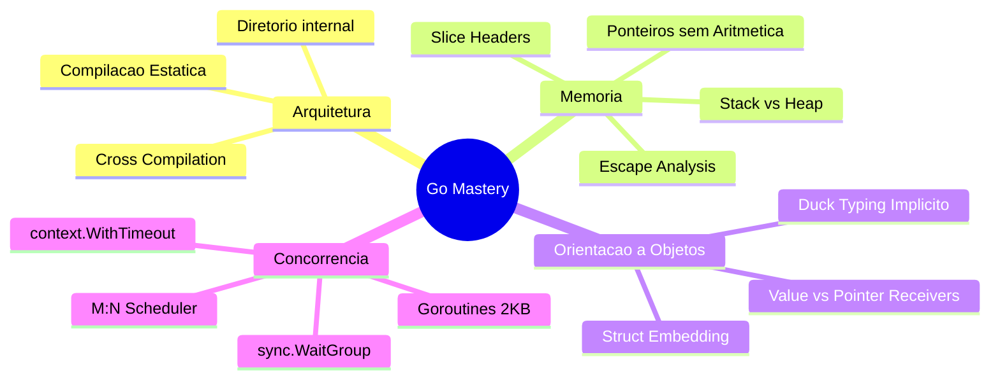

Go (frequentemente chamada de Golang) não foi criada por acaso. Nascida dentro dos laboratórios do Google em 2007 pelas mãos de lendas da ciência da computação — **Robert Griesemer**, **Rob Pike** e **Ken Thompson** (este último, um dos pais do Unix e da linguagem C, além de co-criador da codificação UTF-8) —, a linguagem surgiu para resolver problemas reais de engenharia de software em hiperescala.

Naquela época, o desenvolvimento de infraestrutura e serviços de rede enfrentava um dilema crônico. De um lado, o C++ compilava tão devagar que times inteiros perdiam horas só esperando o código terminar de compilar antes de conseguir testar qualquer coisa. Do outro, o Java consumia memória sem dó e empilhava abstrações sobre abstrações, tornando sistemas simples desnecessariamente complicados. E linguagens dinâmicas como Python, embora ágeis para escrever, não ofereciam nem a segurança de checar os tipos antes de rodar, nem a velocidade de execução exigida em produção. Você não precisa conhecer C++, Java ou Python a fundo para entender o ponto: cada uma resolvia uma parte do problema e criava outra no lugar — e foi exatamente essa lacuna que Go veio preencher.

Go foi desenhada como uma resposta pragmática: **simplicidade sintática**, **ortogonalidade**, **compilação estática ultrarrápida** e suporte nativo de primeira classe à **concorrência**.

Neste guia definitivo, mergulharemos nos fundamentos e mecanismos internos que tornam Go uma das linguagens mais eficientes do mundo para backend e infraestrutura moderna (sistemas como Docker, Kubernetes, Terraform e Prometheus são todos construídos em Go).

---

## 1. Origem, Filosofia & Compilação Cruzada

A premissa central de Go é: *“Menos é exponencialmente mais”*. Go possui apenas 25 palavras-chave reservadas. Não há herança de classes, não há sobrecarga de métodos, não há exceções não checadas (`try/catch`) e não há operadores ternários. A linguagem força o desenvolvedor a escrever código legível, explícito e previsível.

### Compilação Estática e Binários Autocontidos

Diferente de linguagens baseadas em máquina virtual (JVM, CLR) ou interpretadores (Node.js, Python) — que precisam de um programa externo instalado na máquina para traduzir e rodar seu código —, Go compila diretamente para código de máquina nativo (*machine code*), o formato que o processador executa direto, sem intermediários. O binário final embute o seu próprio **Runtime** — um subsistema enxuto (geralmente de poucos megabytes) responsável por gerenciar a memória automaticamente através do **Garbage Collector** (um processo que roda em segundo plano e recicla a memória que seu programa já não usa mais, poupando você de liberá-la manualmente como se faz em C) e por escalonar as **Goroutines** (a unidade de concorrência leve de Go, que vamos explorar em detalhe mais adiante) através do Scheduler M:N.

Isso significa que você não precisa instalar nenhuma dependência no servidor de produção; basta copiar o binário executável e rodá-lo, tornando Go a escolha ideal para contêineres Docker mínimos (`scratch` ou `alpine`).

```dockerfile title="Dockerfile" {6-7}
FROM golang:1.22-alpine AS builder
WORKDIR /app
COPY . .
RUN CGO_ENABLED=0 GOOS=linux go build -o server ./cmd/api

FROM scratch
COPY --from=builder /app/server /server
ENTRYPOINT ["/server"]
```

### Compilação Cruzada (*Cross-Compilation*) Instantânea

Graças ao compilador de Go, compilar para outro sistema operacional ou arquitetura não exige ferramentas externas ou *toolchains* complexas de C. Basta definir as variáveis de ambiente `GOOS` (Target OS) e `GOARCH` (Target Architecture):

```bash title="Terminal"
# Compilar binário para Linux 64-bit a partir do Windows ou macOS
$env:GOOS="linux"; $env:GOARCH="amd64"; go build -o app-linux ./cmd/api

# Compilar para macOS com Apple Silicon (ARM64)
$env:GOOS="darwin"; $env:GOARCH="arm64"; go build -o app-macos-arm ./cmd/api

# Compilar para Windows 64-bit a partir do Linux
GOOS=windows GOARCH=amd64 go build -o app.exe ./cmd/api
```

:::tip
Ao desativar CGO com `CGO_ENABLED=0`, o compilador de Go gera um binário estático puro sem vínculos dinâmicos com a `libc` do sistema hospedeiro, garantindo que o executável funcione em qualquer distribuição Linux sem conflitos de versão de biblioteca.
:::

---

## 2. Sintaxe, Pacotes & Organização de Código

Todo código em Go pertence a um pacote (*package*). O ponto de entrada de qualquer aplicação executável é o pacote `main` contendo a função `main()`.

```go title="main.go"
package main

import "fmt"

func main() {
    fmt.Println("Olá, Gophers!")
}
```

### Visibilidade e Encapsulamento

Go não possui palavras-chave como `public`, `private` ou `protected`. O encapsulamento é determinado exclusivamente pela **primeira letra do identificador**:

- **PascalCase (Primeira letra maiúscula):** Exportado (*public*), visível fora do pacote atual.
- **camelCase (Primeira letra minúscula):** Não-exportado (*package-private*), acessível apenas dentro do mesmo pacote.

```go title="account/account.go"
package account

// Exportado: acessível por outros pacotes
type BankAccount struct {
    Owner   string  // Exportado
    balance float64 // Não-exportado (protegido contra acesso direto externo)
}

// Exportado
func (b *BankAccount) GetBalance() float64 {
    return b.balance
}

// Não-exportado: função utilitária interna do pacote
func validateTaxID(taxID string) bool {
    return len(taxID) == 11
}
```

### O Diretório Especial `internal/`

Go introduziu no compilador uma regra estrita de visibilidade através de diretórios nomeados `internal/`. Qualquer pacote dentro de uma pasta `internal/` só pode ser importado por pacotes que estejam na mesma árvore de diretórios pai.

```text
meu-projeto/
├── cmd/
│   └── api/
│       └── main.go
├── internal/          <-- Pacotes privados do projeto
│   ├── auth/          <-- NINGUÉM de fora do repositório pode importar
│   └── database/
└── pkg/               <-- Código que bibliotecas externas podem importar
    └── logger/
```

Se um projeto externo tentar importar `github.com/empresa/meu-projeto/internal/auth`, o compilador de Go recusará o build com o erro: `use of internal package not allowed`.

---

## 3. Variáveis, Zero Values & Inferência de Tipos

Em Go, variáveis são fortemente e estaticamente tipadas. Existem duas formas principais de declaração:

```go title="variables.go"
// 1. Declaração explícita com 'var' (obrigatório para variáveis globais de pacote ou zero-values)
var totalConnections int
var databaseURL string = "postgres://localhost:5432/db"

func main() {
    // 2. Short variable declaration ':=' (apenas dentro de funções com inferência de tipo)
    port := 8080
    host, isSecure := "127.0.0.1", true

    _ = port
    _ = host
    _ = isSecure
}
```

### A Filosofia do *Zero Value*

Antes de entender COMO isso funciona, entenda POR QUE isso importa: em várias linguagens, uma variável declarada mas não inicializada guarda "lixo" — o que sobrou daquele pedaço de memória antes de ser reutilizado — e ler esse valor por engano é fonte clássica de bugs difíceis de rastrear (e, historicamente, de falhas de segurança). Go elimina essa categoria inteira de problema por decreto: **não existe valor indefinido (`undefined`) ou lixo de memória residual em variáveis não inicializadas**. Ao declarar uma variável sem valor inicial, o compilador garante a atribuição do seu respectivo *Zero Value* — ou seja, um valor padrão previsível e seguro para aquele tipo:

| Tipo | Zero Value |
| :--- | :--- |
| `int`, `int64`, `float64`, `byte`, `rune` | `0` / `0.0` |
| `bool` | `false` |
| `string` | `""` (string vazia, nunca `nil`) |
| Ponteiros (`*T`), `interface`, `slice`, `map`, `chan`, `func` | `nil` |
| `struct` | Struct com todos os campos zerados |

```go title="zerovalues.go"
package main

import "fmt"

type Metrics struct {
    RequestsCount int64
    LatencyMs     float64
    IsActive      bool
}

func main() {
    var m Metrics
    // m já está pronta e segura para uso imediato:
    // {RequestsCount:0, LatencyMs:0, IsActive:false}
    fmt.Printf("%+v\n", m)
}
```

:::note[Design Guideline]
Em Go, uma das maiores diretrizes de design de bibliotecas é: **"Faça o Zero Value ser imediatamente útil"**. Por exemplo, `sync.Mutex` e `bytes.Buffer` não exigem construtores `NewMutex()`; basta declarar `var mu sync.Mutex` e chamar `mu.Lock()`.
:::

---

## 4. Tipos Primitivos, Aliases & Untyped Constants

### Tipos Básicos e Aliases Nativos
- **Inteiros:** `int`, `int8`, `int16`, `int32`, `int64`, `uint`, `uint8`, `uint16`, `uint32`, `uint64`, `uintptr`.
- **Aliases:**
  - `byte` é um alias exato para `uint8` (usado para manipulação de bytes e buffers).
  - `rune` é um alias exato para `int32` (representa um Code Point Unicode UTF-8).
- **Flutuantes e Complexos:** `float32`, `float64`, `complex64`, `complex128`.

### Conversão Explícita Obrigatória
Go não realiza coerção de tipos implícita nem mesmo para tipos compatíveis (ex: `int` para `int64` ou `float32` para `float64`):

```go title="types.go"
var a int32 = 42
var b int64 = int64(a) // Conversão explícita estrita necessária!
```

### *Untyped Constants* (Constantes Não-Tipadas)
Constantes declaradas com `const` possuem precisão arbitrária e não recebem um tipo rígido até que sejam usadas em um contexto específico, permitindo máxima flexibilidade matemática:

```go title="constants.go"
const MaxTimeout = 5000 // Constante inteira não tipada

func main() {
    var f float64 = MaxTimeout // Aceito diretamente sem cast
    var i int64 = MaxTimeout   // Aceito diretamente sem cast
    var d = MaxTimeout * 2     // Mantém precisão sem overflow prematuro
    _, _, _ = f, i, d
}
```

---

## 5. Funções, Múltiplos Retornos, Closures & Variádicas

Funções em Go são cidadãs de primeira classe (*first-class citizens*): podem ser passadas como argumentos, retornadas por outras funções e atribuídas a variáveis.

### Múltiplos Retornos e o Idioma `(T, error)`

Go não utiliza exceções para fluxo de erro. O padrão idiomático mundial de Go é retornar o resultado acompanhado de um `error` como último parâmetro:

```go title="functions.go"
func Divide(a, b float64) (float64, error) {
    if b == 0 {
        return 0, fmt.Errorf("divisão por zero não é permitida")
    }
    return a / b, nil
}
```

### Funções Variádicas e Closures

Uma *closure* é simplesmente uma função que "lembra" das variáveis do lugar onde foi criada, mesmo depois que esse lugar (a função que a criou) já terminou de executar. É útil sempre que você quer uma função com um pedacinho de estado privado grudado nela — no exemplo abaixo, um contador que só aquela função gerada consegue enxergar e incrementar.

```go title="closures.go"
package main

import "fmt"

// Função Variádica: aceita zero ou mais inteiros
func Sum(numbers ...int) int {
    total := 0
    for _, n := range numbers {
        total += n
    }
    return total
}

// Closure: fábrica de geradores de ID com estado encapsulado
func IDGenerator(prefix string) func() string {
    counter := 0
    return func() string {
        counter++
        return fmt.Sprintf("%s-%04d", prefix, counter)
    }
}

func main() {
    gen := IDGenerator("USR")
    fmt.Println(gen()) // USR-0001
    fmt.Println(gen()) // USR-0002
    
    vals := []int{10, 20, 30}
    fmt.Println(Sum(vals...)) // Desempacotamento com '...' -> 60
}
```

---

## 6. Controle de Fluxo: `if`, `switch` e `for` no Go 1.22

Go simplificou o controle de fluxo: existe apenas uma estrutura de repetição (`for`) e condicionais expressivas.

### `if` com *Short Statement*
Permite executar uma instrução antes da verificação booleana, limitando o escopo da variável ao bloco do `if/else`:

```go title="flow.go"
if val, err := fetchSecret("API_KEY"); err != nil {
    log.Fatalf("Erro crítico: %v", err)
} else {
    fmt.Printf("Secret carregada com sucesso: %s\n", val)
}
// 'val' e 'err' não poluem o escopo exterior!
```

### `switch` Moderno: Sem `break` e Tagless

Em Go, os casos de um `switch` não continuam a execução para o próximo bloco (*no fallthrough by default*), eliminando a necessidade manual de `break`. O `switch` sem expressão (*tagless switch*) substitui longas cadeias de `if/else if`:

```go title="switch.go"
func classifyScore(score int) string {
    switch {
    case score >= 90:
        return "Excelente"
    case score >= 70:
        return "Aprovado"
    case score >= 50:
        return "Recuperação"
    default:
        return "Reprovado"
    }
}
```

### A Evolução do `for` e o Marco do Go 1.22

Go tem apenas a palavra-chave `for`, servindo como `for` tradicional, `while` e loop infinito:

```go title="loops.go"
// 1. Estilo C tradicional
for i := 0; i < 5; i++ {}

// 2. Estilo While
for active {}

// 3. Loop Infinito
for {
    break
}

// 4. Go 1.22+: Range sobre inteiros
for i := range 5 {
    fmt.Print(i, " ") // Imprime: 0 1 2 3 4
}
```

:::important[A Revolução do Go 1.22 no Escopo do For Range]
Antes do Go 1.22, as variáveis do `for range` eram reutilizadas em todas as iterações (alocadas uma única vez no início do loop), o que causava o clássico bug de captura de referência em Goroutines e Closures. A partir do **Go 1.22**, cada iteração cria uma **nova instância de variável**, eliminando a necessidade de truques manuais como `item := item`!
:::

```diff lang="go" title="go122_scoping.go"
  for _, item := range items {
-     // Pré Go 1.22: era OBRIGATÓRIO fazer cópia local:
-     item := item
      go func() {
          process(item) // 100% seguro nativamente a partir do Go 1.22+!
      }()
  }
```

---

## 7. Arrays vs Slices: Anatomia, Headers e BCE

Compreender a diferença entre Arrays e Slices é o divisor de águas entre um programador iniciante e um engenheiro de software sênior em Go.

### Arrays: Tamanho Fixo e Passagem por Cópia de Valor
Em Go, o tamanho faz parte do tipo do array. `[3]int` é um tipo completamente diferente de `[5]int`. Ao atribuir ou passar um array para uma função, **todo o conteúdo é copiado na memória**.

```go title="arrays.go"
var a [3]int = [3]int{1, 2, 3}
b := a // Copia os 3 elementos inteiros
b[0] = 999
fmt.Println(a[0]) // Imprime 1 (o array original permaneceu intacto)
```

### Slices: Janelas Dinâmicas sobre um Backing Array

Antes de entender COMO um slice é montado por dentro, entenda POR QUE isso importa na prática: essa estrutura interna é o que explica por que passar um slice gigante para uma função é praticamente grátis (você não está copiando os elementos, só um pequeno "controle remoto"), e também por que, às vezes, modificar um slice pode misteriosamente afetar outra variável que parecia não ter relação nenhuma com ele. Um Slice não armazena dados diretamente — quem guarda os dados de verdade é o **Backing Array** (o array real, escondido por trás do slice, na memória). O slice em si é apenas um **Slice Header** de 24 bytes (em sistemas 64-bit) composto por:
1. `Data unsafe.Pointer`: Ponteiro para o primeiro elemento no array subjacente (*Backing Array*).
2. `Len int` (8 bytes): Número atual de elementos acessíveis no slice.
3. `Cap int` (8 bytes): Capacidade total a partir do ponteiro até o fim do Backing Array.

```text
       Slice Header (24 bytes)
  +---------------+-------+-------+
  |  Data Pointer | Len=3 | Cap=5 |
  +-------+-------+-------+-------+
          |
          v
Backing Array na memória:
  +-----+-----+-----+-----+-----+
  | 10  | 20  | 30  |  0  |  0  |
  +-----+-----+-----+-----+-----+
```

### A Mecânica do `append()` e Pré-alocação com `make`

Quando `append()` adiciona elementos além do `Cap` atual, o runtime de Go aloca um novo Backing Array maior (geralmente dobrando até certo limiar), copia os dados antigos e atualiza o ponteiro do Slice Header.

```go title="slices.go" {2,7}
// Ineficiente: causa múltiplas realocações no Heap e trabalho extra ao GC
var slow []int
for i := 0; i < 10000; i++ {
    slow = append(slow, i)
}

// Alta Performance: Pré-alocação evita alocações intermediárias
fast := make([]int, 0, 10000)
for i := 0; i < 10000; i++ {
    fast = append(fast, i)
}
```

### Full Slice Expression: `[low:high:max]`

Ao fatiar um slice existente (`sub := orig[0:2]`), o novo slice compartilha o mesmo Backing Array. Se você der `append()` no `sub`, poderá sobrescrever dados do slice original! Para evitar isso, use a **Full Slice Expression** que limita a capacidade do slice derivado:

```go title="full_slice.go" {6}
original := []int{1, 2, 3, 4, 5} // len: 5, cap: 5

// sub compartilha o array e sua capacidade vai até o final (cap: 5)
// sub := original[0:2]

// Full Slice Expression: [low:high:max] -> len = high-low (2), cap = max-low (2)
subSafe := original[0:2:2]

// Agora, qualquer append em subSafe forçará a criação de um novo Backing Array,
// blindando 'original' contra mutações acidentais!
subSafe = append(subSafe, 99)
fmt.Println(original) // [1 2 3 4 5] - Intacto!
```

Repare que a única mudança de código foi acrescentar `:2` no fatiamento (`[0:2:2]` em vez de `[0:2]`). Esse terceiro número trava o `Cap` do slice derivado no mesmo valor do `Len`, então, na próxima vez que alguém der `append()` nele, não sobra espaço livre no Backing Array compartilhado — Go é obrigado a criar um array novo, e o `original` fica protegido.

### Bounds Check Elimination (BCE)

Toda vez que você acessa `slice[i]`, Go verifica em tempo de execução se `i` realmente existe dentro do slice — é essa checagem que evita os bugs de "buffer overflow" (ler memória além do que deveria) tão comuns em linguagens como C. Essa verificação tem um custo, ainda que pequeno. O compilador de Go insere essas verificações de limite automaticamente para evitar leitura fora do array (`index out of range`). Escrever loops que permitam ao compilador provar matematicamente que os limites são sempre seguros resulta em eliminação de verificações (*BCE*, de *Bounds Check Elimination*) — ou seja, o compilador remove a checagem por saber, com certeza, que ela nunca falharia —, gerando loops em assembly com performance comparável a C puro, sem abrir mão da segurança do dia a dia.

---

## 8. Ponteiros, Mutabilidade e Nil Pointers

Go possui ponteiros, mas **não possui aritmética de ponteiros** (diferente de C), o que previne vulnerabilidades de corrupção de memória.

- `&`: Operador de referência (obtém o endereço de memória de uma variável).
- `*`: Operador de desreferenciação (acessa ou modifica o valor contido no endereço) ou declaração de tipo ponteiro.

```go title="pointers.go"
func increment(val *int) {
    if val == nil {
        return // Previne Nil Pointer Dereference (Panic)
    }
    *val++ // Altera diretamente o valor na memória original
}

func main() {
    x := 10
    increment(&x)
    fmt.Println(x) // 11
}
```

:::caution[Perigo do Nil Pointer Dereference]
Tentar desreferenciar um ponteiro que aponta para `nil` (`var p *int; *p = 5`) causa um `runtime panic: runtime error: invalid memory address or nil pointer dereference`. Sempre verifique se o ponteiro é diferente de `nil` antes de utilizá-lo quando ele vier de parâmetros externos.
:::

---

## 9. Memória: Stack vs Heap & Escape Analysis

Entender como Go gerencia a memória no nível de máquina é fundamental para construir sistemas de alta performance. Se você vem de linguagens como Python, JavaScript ou Java, provavelmente nunca precisou pensar em *onde* uma variável mora fisicamente na memória — o Garbage Collector cuida disso nos bastidores e você nem percebe. Em Go essa distinção fica visível e é ela que separa código que aloca memória à toa (e sobrecarrega o GC sem necessidade) de código genuinamente rápido.

### Stack vs Heap
- **Stack (Pilha):** Cada Goroutine possui sua própria pilha que começa com míseros **2KB a 4KB** e cresce dinamicamente sob demanda. A alocação e liberação na Stack são praticamente instantâneas (apenas um decremento/incremento de ponteiro de pilha na CPU). Não gera trabalho para o Garbage Collector.
- **Heap:** Área de memória compartilhada para dados cuja vida útil ultrapassa o retorno da função ou cujo tamanho não pôde ser determinado em tempo de compilação. Gerenciada pelo Garbage Collector (GC) concorrente *Tri-color Mark-and-Sweep* de Go.

Na prática: Stack é rápida e descartada automaticamente quando a função acaba; Heap é mais flexível, mas exige que o Garbage Collector fique de olho nela para saber quando pode liberá-la — e esse trabalho extra tem custo de CPU.

### Escape Analysis (*Análise de Escape*)

Antes de entender COMO o compilador decide isso, entenda POR QUE você deveria se importar: toda variável que acaba indo parar no Heap vira responsabilidade do Garbage Collector, que gasta tempo de CPU rastreando-a e, eventualmente, liberando-a. Código com poucas alocações no Heap tende a ser bem mais rápido — por isso ferramentas de profiling em Go sempre reportam quantas alocações um trecho de código está fazendo.

Em C ou C++, retornar o endereço de uma variável local (`&x`) resulta em comportamento indefinido (*Dangling Pointer / Segfault*, ou seja, um ponteiro "pendurado" apontando para memória que já foi destruída), pois o frame da função é destruído na saída.

**Em Go, retornar `&x` é 100% seguro!** O compilador executa a **Escape Analysis** durante o build — uma análise que rastreia se o endereço de uma variável "escapa" do escopo onde ela nasceu: se ele detectar que a variável sobrevive após o retorno da função, ele automaticamente aloca essa variável no **Heap** em vez da Stack, sem que você precise fazer nada manualmente.

```go title="escape.go"
package main

type User struct {
    ID   int
    Name string
}

// u 'escapa' para o Heap porque seu ponteiro é retornado para fora
func NewUser(id int, name string) *User {
    u := User{ID: id, Name: name}
    return &u // Seguro em Go! Compilador move para o Heap
}

// v NÃO escapa, permanece 100% na Stack (Zero overhead de GC)
func CalculateSum(a, b int) int {
    v := a + b
    return v
}
```

Compare as duas funções: `NewUser` devolve `&u`, o endereço de uma variável local — como esse endereço "escapa" da função, `u` é promovida para o Heap. Já `CalculateSum` só devolve um valor simples (`v`, um `int` comum, não um endereço), então `v` nunca precisa sair da Stack e some sem custo algum assim que a função retorna.

Podemos inspecionar o que o compilador faz com a flag `-gcflags="-m"`, que imprime exatamente quais variáveis foram promovidas ao Heap e por quê:

```bash title="Terminal"
$ go build -gcflags="-m" ./...
./escape.go:10:2: moved to heap: u
```

---

## 10. O Mecanismo do `defer`

A instrução `defer` agenda a execução de uma função para o momento imediatamente posterior ao encerramento da função envolvente (seja por `return` normal ou por um `panic`). Pense nela como um post-it colado na porta: "antes de sair da sala, apague a luz" — não importa por qual caminho você saia, aquele lembrete sempre roda no final.

### Ordem LIFO (Last-In, First-Out)
Múltiplas chamadas de `defer` são empilhadas e executadas na ordem inversa:

```go title="defer_order.go"
func main() {
    defer fmt.Println("1")
    defer fmt.Println("2")
    defer fmt.Println("3")
}
// Saída: 3, depois 2, depois 1
```

### Avaliação Imediata de Argumentos vs Closures

Os argumentos de uma função deferida são **avaliados imediatamente** no momento em que a linha do `defer` é lida, e não quando ela é executada:

```go title="defer_eval.go"
package main

import (
    "fmt"
    "time"
)

func track() {
    start := time.Now()
    
    // ATENÇÃO: time.Since(start) seria avaliado AQUI (0s) se chamado direto:
    // defer fmt.Println("Tempo:", time.Since(start)) // ERRADO

    // CORRETO: Usar closure anônima para avaliar na saída:
    defer func() {
        fmt.Println("Duração real:", time.Since(start))
    }()

    time.Sleep(100 * time.Millisecond)
}
```

:::warning[Armadilha do Defer dentro de Loops Longos]
O `defer` só executa quando a **função** termina, e **não** quando o bloco do loop termina! Colocar `defer f.Close()` dentro de um loop de 1 milhão de iterações manterá 1 milhão de arquivos abertos simultaneamente até a função retornar, estourando os descritores de arquivo do sistema operacional (*Too many open files*).
:::

```go title="defer_loop_fix.go" {6-10}
// Solução: Envolver o corpo em uma função anônima que executa a cada ciclo
for _, filename := range files {
    func() {
        f, err := os.Open(filename)
        if err != nil { return }
        defer f.Close() // Fecha com segurança a cada iteração!
        process(f)
    }()
}
```

---

## 11. Maps: Hash Tables, Concorrência e o Idioma Comma-Ok

Maps em Go são tabelas de dispersão (*Hash Tables*) altamente otimizadas que associam chaves a valores: `map[KeyType]ValueType`.

### Leitura Segura vs Escrita com Panic em `nil map`

Um `nil map` pode ser lido com segurança (retornará sempre o *zero value* do tipo de dado), mas **escrever em um `nil map` resulta em panic fatal**:

```go title="maps.go"
var uninitMap map[string]int
fmt.Println(uninitMap["idade"]) // Seguro: imprime 0

// uninitMap["idade"] = 30 // PANIC: assignment to entry in nil map

// Inicialização correta:
validMap := make(map[string]int)
validMap["idade"] = 30 // Perfeito!
```

### O Idioma *Comma-Ok* e Limpeza com `clear()`

Isso cria um problema prático: se você buscar `scores["Bob"]` e receber `0`, como saber se "Bob" realmente tem nota zero ou se ele simplesmente não existe no map? Como consultar uma chave ausente retorna o zero value, usamos o padrão *comma-ok* (pedir dois valores de volta, onde o segundo é um booleano "ok, achei" ou "não, não achei") para distinguir entre uma chave inexistente e uma chave presente com valor zero:

```go title="comma_ok.go"
scores := map[string]int{"Alice": 0}

score, exists := scores["Alice"]
fmt.Printf("Score: %d, Existe: %t\n", score, exists) // 0, true

score, exists = scores["Bob"]
fmt.Printf("Score: %d, Existe: %t\n", score, exists) // 0, false

// Go 1.21+: Função nativa clear() esvazia todos os elementos mantendo a alocação
clear(scores)
```

:::note[Maps e Não-Determinismo]
A iteração em maps com `for k, v := range myMap` produz uma ordem aleatória intencional por design no runtime de Go para evitar que desenvolvedores criem dependências de ordenação de chaves. Além disso, maps **não são seguros para leitura e escrita concorrente** (use `sync.RWMutex` ou `sync.Map`).
:::

---

## 12. Structs, Métodos & Composição sobre Herança

Go implementa o paradigma de Orientação a Objetos de forma pura através de tipos e composição, sem a rigidez de hierarquias de classes.

### Value Receiver vs Pointer Receiver

Um *receiver* é o parâmetro especial escrito entre `func` e o nome do método — pense nele como o `this`/`self` de outras linguagens, a variável que dá acesso à própria struct dentro do método. Ao associar métodos a uma struct, podemos escolher entre dois tipos de *receiver*:

```go title="receivers.go"
type Point struct {
    X, Y float64
}

// 1. Value Receiver: Recebe uma CÓPIA da struct.
// Seguro para concorrência e objetos imutáveis pequenos.
func (p Point) DistanceFromOrigin() float64 {
    return math.Sqrt(p.X*p.X + p.Y*p.Y)
}

// 2. Pointer Receiver: Recebe uma REFERÊNCIA.
// Obrigatório para mutar estado interno ou evitar cópias de structs grandes.
func (p *Point) Move(dx, dy float64) {
    p.X += dx
    p.Y += dy
}
```

:::tip[Convenção de Consistência]
Se ao menos um método de uma struct exigir Pointer Receiver (por mutabilidade ou tamanho), **todos** os outros métodos dessa mesma struct devem adotar Pointer Receiver por consistência.
:::

### Struct Embedding (Composição)

Go não possui a palavra-chave `extends`. A reutilização de código e polimorfismo são alcançados através do *Embedding* (campos anônimos): você coloca uma struct dentro de outra sem dar um nome ao campo, e o compilador passa a "promover" automaticamente os campos e métodos da struct interna, como se pertencessem à struct externa.

```go title="embedding.go"
type BaseEntity struct {
    ID        string
    CreatedAt time.Time
}

func (b *BaseEntity) IsPersisted() bool {
    return b.ID != ""
}

type Customer struct {
    BaseEntity // Struct Embedding (composição pura)
    Name       string
    Email      string
}

func main() {
    c := Customer{
        BaseEntity: BaseEntity{ID: "uuid-123", CreatedAt: time.Now()},
        Name:       "Gopher Silva",
        Email:      "gopher@golang.org",
    }

    // Campos e métodos de BaseEntity são promovidos diretamente para Customer!
    fmt.Println(c.ID)          // uuid-123
    fmt.Println(c.IsPersisted()) // true
}
```

---

## 13. Interfaces, Duck Typing & A Armadilha do Typed Nil

As interfaces em Go são o ápice da elegância da linguagem. Elas são satisfeitas de forma **100% implícita** (*Duck Typing*: *"Se algo anda como um pato e grasna como um pato, então é um pato"*).

Você não escreve `implements MyInterface`. Se um tipo implementa o conjunto exato de métodos requeridos pela interface, ele automaticamente satisfaz a interface.

```go title="interfaces.go"
type Notifier interface {
    Send(message string) error
}

type EmailService struct{}

func (e *EmailService) Send(msg string) error {
    fmt.Println("Enviando e-mail:", msg)
    return nil
}

// Recebe qualquer coisa que satisfaça Notifier
func NotifyUser(n Notifier, message string) {
    _ = n.Send(message)
}
```

### Representação Interna de uma Interface

Antes de mais nada, uma imagem mental simples: pense numa variável de interface como um envelope com duas informações coladas nele — uma etiqueta dizendo *"o que tem dentro"* (o tipo) e o conteúdo em si (o valor). Uma variável de interface em Go não é um ponteiro simples; ela é uma estrutura de dois ponteiros na memória:
1. **`_type` / `tab` (`*itab`):** a etiqueta — informações sobre o tipo concreto armazenado e a *interface table* (tabela de despacho que mapeia os métodos do tipo concreto para a interface).
2. **`data` (`unsafe.Pointer`):** o conteúdo — ponteiro para o valor concreto na memória.

```text
       Interface Header (16 bytes)
  +------------------+------------------+
  | itab / Type Info |   Data Pointer   |
  +------------------+------------------+
```

Uma interface só é considerada `nil` quando **ambos os ponteiros (`type` e `data`) são nulos** — ou seja, o envelope inteiro (etiqueta E conteúdo) precisa estar vazio.

### A Perigosa Armadilha do *Typed Nil*

Este é um dos bugs mais comuns e sutis na jornada de um desenvolvedor Go — e ele confunde até programadores experientes na primeira vez que o encontram. A ideia central: é perfeitamente possível ter um envelope cuja etiqueta está preenchida (diz "sou um `*CustomError`"), mas cujo conteúdo está vazio (`nil`). Como a etiqueta não está vazia, o Go considera esse envelope **diferente de nil**, mesmo que, na prática, o valor dentro dele seja nulo. É exatamente isso que acontece no exemplo abaixo:

```go title="typed_nil_trap.go" {14-16}
package main

import "fmt"

type CustomError struct{}

func (e *CustomError) Error() string {
    return "algo deu errado"
}

func doWork() error {
    var err *CustomError = nil // err é um ponteiro tipado (*CustomError) com valor nil
    
    // RETORNAR err DIRETAMENTE É UMA ARMADILHA!
    // A interface 'error' de retorno receberá:
    // (Type: *CustomError, Data: nil) -> Portanto, a interface NÃO É NIL!
    return err 
}

func main() {
    err := doWork()
    if err != nil {
        fmt.Println("ERRO DETECTADO:", err) // ISTO SERÁ EXECUTADO!
    } else {
        fmt.Println("Sucesso!")
    }
}
```

Repare no que acontece passo a passo: dentro de `doWork`, `err` é um ponteiro `*CustomError` com valor `nil` — até aí, nada de errado. O problema surge na linha `return err`: como a função retorna o tipo `error` (uma interface), Go copia a etiqueta (`*CustomError`) e o conteúdo (`nil`) para dentro do envelope da interface. O envelope resultante tem etiqueta preenchida, então `err != nil` é verdadeiro em `main`, e o bloco `if err != nil` executa — mesmo sem nenhum erro real ter acontecido!

:::caution[Como Evitar a Armadilha do Typed Nil]
Ao retornar `error`, sempre retorne o literal explícito `nil` em vez de variáveis ponteiro não inicializadas:
```go
if !hasError {
    return nil // Correto e Seguro!
}
```
:::

---

## 14. Type Assertions, Type Switches & A Convenção `-er`

### Type Assertions (`v, ok := i.(Target)`)

Permite extrair com segurança o tipo concreto subjacente contido dentro de uma interface:

```go title="type_assertions.go"
func ProcessPayload(data any) {
    // Comma-ok evita panic se data não for string
    if str, ok := data.(string); ok {
        fmt.Println("Payload é uma string de tamanho:", len(str))
    }
}
```

### Type Switches
Permite ramificar a lógica baseando-se no tipo dinâmico da interface:

```go title="type_switch.go"
func Describe(i any) {
    switch v := i.(type) {
    case int:
        fmt.Printf("Inteiro: %d\n", v*2)
    case string:
        fmt.Printf("String: %q\n", v)
    case fmt.Stringer:
        fmt.Printf("Implementa Stringer: %s\n", v.String())
    default:
        fmt.Printf("Tipo desconhecido: %T\n", v)
    }
}
```

### A Convenção de Sufixo `-er`
Em Go, interfaces com apenas um método recebem convencionalmente o nome do método seguido pelo sufixo `-er`:
- `Read` -> `io.Reader`
- `Write` -> `io.Writer`
- `String` -> `fmt.Stringer`
- `Close` -> `io.Closer`

---

## 15. Tratamento de Erros Profissional (Go 1.13+ e Go 1.20+)

Erros em Go são valores comuns que satisfazem a interface nativa embutida:

```go title="builtin.go"
type error interface {
    Error() string
}
```

### Error Wrapping com `%w`
A partir do Go 1.13, você pode empilhar contexto aos erros mantendo a cadeia causal intacta usando o verbo `%w` no `fmt.Errorf`:

```go title="wrapping.go"
// ErrNotFound é um "erro sentinela": um valor de erro fixo, criado uma única vez,
// que serve como marcador reconhecível para ser comparado depois com errors.Is.
var ErrNotFound = errors.New("recurso não encontrado")

func findUser(id string) error {
    return fmt.Errorf("falha ao consultar banco: %w", ErrNotFound)
}
```

### `errors.Is` vs `errors.As`

- **`errors.Is(err, target)`:** Percorre a cadeia de erros comparando se algum erro na árvore coincide com o erro sentinela `target` (substitui com maestria o frágil `err == ErrNotFound`).
- **`errors.As(err, &targetStruct)`:** Percorre a cadeia e extrai o erro para uma struct customizada caso ele exista na árvore.

```go title="errors_inspection.go" {15,20}
package main

import (
    "errors"
    "fmt"
)

type DatabaseTimeoutError struct {
    Host string
    Port int
}

func (d *DatabaseTimeoutError) Error() string {
    return fmt.Sprintf("timeout conectando a %s:%d", d.Host, d.Port)
}

func query() error {
    return fmt.Errorf("camada de serviço: %w", &DatabaseTimeoutError{Host: "10.0.0.1", Port: 5432})
}

func main() {
    err := query()

    // 1. Extração tipada com errors.As (obrigatório passar ponteiro para o ponteiro)
    var dbErr *DatabaseTimeoutError
    if errors.As(err, &dbErr) {
        fmt.Printf("Falha na porta do banco: %d\n", dbErr.Port)
    }
}
```

### `errors.Join` (Go 1.20+)
Permite agrupar múltiplos erros simultâneos (muito comum em rotinas de validação ou encerramento de múltiplos recursos concorrentes):

```go title="errors_join.go"
func Validate(u User) error {
    var errs []error
    if u.Name == "" {
        errs = append(errs, errors.New("nome é obrigatório"))
    }
    if u.ID <= 0 {
        errs = append(errs, errors.New("id inválido"))
    }
    return errors.Join(errs...)
}
```

---

## 16. Streams, E/S de Alta Performance & Abstrações `io`

As interfaces `io.Reader` e `io.Writer` são as espinhas dorsais de todo o ecossistema de entrada e saída (I/O) em Go.

Antes do código, pense numa analogia simples: encher um balde usando um copo pequeno, em vez de tentar despejar uma piscina inteira de uma vez. Você entrega um copo (o buffer `p`) ao `Read`, e ele te diz de volta *quantos bytes ele efetivamente colocou no seu copo* (`n`) — pode ser o copo cheio, pode ser só um pouco, dependendo do que tinha disponível na fonte no momento. Esse é o "contrato": quem chama fornece o espaço, quem implementa a interface preenche o que conseguir e reporta quanto preencheu. É esse design simples que permite processar arquivos de qualquer tamanho — até gigabytes — sem nunca carregar tudo de uma vez na memória.

```go title="io_interfaces.go"
type Reader interface {
    Read(p []byte) (n int, err error)
}

type Writer interface {
    Write(p []byte) (n int, err error)
}
```

### O Contrato do Buffer e `io.EOF`
Ao ler de um `io.Reader`, você fornece o buffer `p` e a função retorna quantos bytes `n` foram lidos. O fim do fluxo é sinalizado pela sentinela `io.EOF`.

```go title="stream_reader.go"
func ProcessStream(r io.Reader) error {
    buf := make([]byte, 4096) // Buffer reutilizável de 4KB
    for {
        n, err := r.Read(buf)
        if n > 0 {
            chunk := buf[:n] // Sempre fatie de 0 até n!
            fmt.Printf("Processados %d bytes\n", len(chunk))
        }
        if err == io.EOF {
            break // Fim normal do stream
        }
        if err != nil {
            return err // Erro real de E/S
        }
    }
    return nil
}
```

Note o `for` sem condição: ele roda indefinidamente, "enchendo o copo" a cada chamada de `r.Read(buf)`, até que o próprio `Read` sinalize `io.EOF` — o fim natural do stream, tratado como saída normal do laço, não como erro.

### Composição de Streams (Padrão Decorator)

Você pode encadear leitores e escritores como blocos de LEGO sem carregar todo o arquivo na memória RAM:

```go title="stream_pipeline.go"
// Pipeline: Arquivo Compactado -> Descompressão GZIP -> Leitura com Buffer
file, _ := os.Open("dados.gz")
defer file.Close()

gzReader, _ := gzip.NewReader(file)
defer gzReader.Close()

// Copia do descompressor direto para stdout com zero alocação intermediária
io.Copy(os.Stdout, gzReader)
```

:::important[Evite `io.ReadAll` em Produção sem Limites]
Chamar `io.ReadAll(resp.Body)` em endpoints públicos é uma vulnerabilidade clássica de negação de serviço (DoS / OOM Kill), pois um payload malicioso de 5GB consumirá 5GB de RAM instantaneamente. Prefira `io.Copy` ou limite o leitor com `io.LimitReader(resp.Body, 10<<20)` (10MB max).
:::

---

## 17. Generics (Go 1.18+): Polimorfismo Paramétrico

Lançado no Go 1.18, o suporte a Generics trouxe reutilização de código com segurança estática de tipos, sem recorrer a `any` ou *reflection*.

Você pode se perguntar: "por que não simplesmente usar `any` (interface vazia) e resolver tudo em runtime?" O problema é que `any` joga fora toda a informação de tipo — o compilador não sabe mais o que tem lá dentro, então você perde o autocomplete, perde erros de compilação úteis (trocando isso por panics em produção) e precisa fazer *type assertions* manuais o tempo todo para recuperar o tipo original. Generics resolvem isso: você escreve a função uma única vez, mas o compilador ainda sabe, em cada chamada, exatamente qual tipo concreto está sendo usado — juntando a reutilização de código do `any` com a segurança de tipos de escrever uma função separada para cada tipo.

### Parâmetros de Tipo e Restrições (`Constraints`)

Uma *constraint* (restrição) é simplesmente uma regra que diz quais tipos são aceitos no lugar de `T` — por exemplo, "só tipos que suportam `==`" ou "só tipos numéricos". Ela aparece entre colchetes, logo após o nome da função ou struct:

```go title="generics.go"
package main

import "fmt"

// Constraint 'comparable' permite operadores == e !=
func Contains[T comparable](slice []T, target T) bool {
    for _, item := range slice {
        if item == target {
            return true
        }
    }
    return false
}

// Struct Genérica: Pilha LIFO tipada
type Stack[T any] struct {
    elements []T
}

func (s *Stack[T]) Push(val T) {
    s.elements = append(s.elements, val)
}

func (s *Stack[T]) Pop() (T, bool) {
    if len(s.elements) == 0 {
        var zero T
        return zero, false
    }
    val := s.elements[len(s.elements)-1]
    s.elements = s.elements[:len(s.elements)-1]
    return val, true
}
```

Vale entender essa `Stack[T]` com calma, pois é um bom exemplo de generics "no mundo real". `Stack[T any]` diz: "essa struct funciona para qualquer tipo `T`, seja ele `int`, `string` ou uma struct sua" — e uma vez que você escreve `Stack[int]{}`, todos os métodos passam a operar exclusivamente com `int`, com checagem em tempo de compilação. Repare também no `Pop`: quando a pilha está vazia, não há um elemento real para devolver, então a linha `var zero T` cria o *zero value* do tipo `T` (`0` para `int`, `""` para `string`, etc.) — o mesmo padrão *comma-ok* que já vimos em maps, agora generalizado para qualquer tipo.

### Type Sets e o Operador de Aproximação `~T`

Uma *constraint* como `comparable` ou a `Number` que veremos a seguir é, tecnicamente, um **Type Set**: o conjunto de todos os tipos que satisfazem aquela restrição. Pense nela como uma "lista de tipos permitidos" que o compilador consulta antes de aceitar sua chamada.

O operador til (`~`) permite que uma restrição inclua todos os tipos definidos cujo tipo subjacente (*underlying type*) seja aquele especificado:

```go title="type_sets.go"
// Aceita int, int32, int64, float32, float64 E tipos customizados como 'type UserID int64'
type Number interface {
    ~int | ~int32 | ~int64 | ~float32 | ~float64
}

func Min[T Number](a, b T) T {
    if a < b {
        return a
    }
    return b
}

type PortNumber int

func main() {
    var p1, p2 PortNumber = 8080, 9000
    fmt.Println(Min(p1, p2)) // Funciona perfeitamente graças ao ~int!
}
```

---

## 18. Concorrência: Goroutines & O Scheduler M:N

Uma *goroutine* é, na prática, uma função rodando de forma independente das demais — você a inicia colocando a palavra-chave `go` na frente de uma chamada de função, e o runtime de Go cuida de executá-la "ao fundo", sem bloquear o resto do programa.

Vale distinguir dois conceitos que soam parecidos: concorrência não é paralelismo. Concorrência é sobre **estruturar** seu programa como a composição de processos autônomos e independentes (dividir o trabalho em partes que podem progredir de forma intercalada); paralelismo é a execução simultânea real dessas partes em múltiplos núcleos de CPU. Você pode ter concorrência mesmo numa máquina de um núcleo só — o Go apenas alterna entre as goroutines rapidamente.

### Goroutines vs Threads de Sistema Operacional

| Característica | OS Thread | Go Goroutine |
| :--- | :--- | :--- |
| **Tamanho Inicial da Stack** | 1 MB a 2 MB (Fixo) | **2 KB a 4 KB** (Crescimento Dinâmico) |
| **Custo de Criação / Troca de Contexto** | Alto (requer trap para o kernel) | Mínimo (~poucos nanossegundos em User Space) |
| **Quantidade Suportada** | Alguns milhares | **Milhões simultâneas** |

### O Scheduler M:N de Go
O runtime de Go utiliza o modelo **M:N Scheduler** com técnica de *Work Stealing*:
- **G (Goroutine):** Representa a Goroutine com sua stack e instruction pointer.
- **M (Machine):** Representa a Thread real do Sistema Operacional criada pelo kernel.
- **P (Processor):** Contexto de execução lógica que detém a fila local de Goroutines prontas para rodar.

```text
+---------------+     +---------------+
| Processor P0  |     | Processor P1  |
| Local Queue:  |     | Local Queue:  |
| [G1] [G2] [G3]|     | [G4] [G5]     |
+-------+-------+     +-------+-------+
        |                     |
        v                     v
+---------------+     +---------------+
|  OS Thread M0 |     |  OS Thread M1 |
|  Executando G0|     |  Executando G6|
+---------------+     +---------------+
```

Se o processador `P1` esgotar suas tarefas, ele "rouba" (*Work Stealing*) metade das Goroutines da fila de `P0`, mantendo todos os núcleos da CPU constantemente ocupados sem gargalos de sincronização global.

### Sincronização Segura com `sync.WaitGroup`

```go title="concurrency_waitgroup.go" {12,14,18}
package main

import (
    "fmt"
    "net/http"
    "sync"
)

func checkURL(url string, wg *sync.WaitGroup) {
    defer wg.Done() // Garante decremento do contador no encerramento

    resp, err := http.Get(url)
    if err != nil {
        fmt.Printf("[ERRO] %s: %v\n", url, err)
        return
    }
    defer resp.Body.Close() // Boa prática indispensável

    fmt.Printf("[OK] %s -> Status: %s\n", url, resp.Status)
}

func main() {
    urls := []string{
        "https://golang.org",
        "https://google.com",
        "https://github.com",
    }

    var wg sync.WaitGroup

    for _, u := range urls {
        wg.Add(1)
        go checkURL(u, &wg) // Passar ponteiro do WaitGroup!
    }

    wg.Wait() // Bloqueia a main até que todos os wg.Done() sejam chamados
    fmt.Println("Todas as checagens foram concluídas!")
}
```

---

## 19. Contextos: Cancelamento, Timeouts e Deadlines

O pacote `context` é a espinha dorsal para gerenciar o ciclo de vida, sinais de cancelamento e prazos de requisições concorrentes em Go. Na prática, um `context.Context` é um valor que você passa como primeiro argumento por toda a cadeia de chamadas de uma requisição — como um "bilhete" carregado por todas as funções envolvidas, que pode ser "carimbado" com um prazo ou cancelado a qualquer momento, avisando todas as goroutines dependentes para pararem o que estão fazendo.

```go title="context_tree.go"
// Raiz imutável
ctx := context.Background()

// Derivação com Timeout de 2 segundos
ctxTimeout, cancel := context.WithTimeout(ctx, 2*time.Second)
defer cancel() // SEMPRE invoque o cancel para liberar recursos da árvore de timer!
```

### Requisições HTTP Resilientes com Contexto

Se o cliente fechar a conexão ou o tempo limite expirar, o contexto notifica a Goroutine através do canal `ctx.Done()`, cancelando imediatamente o processamento de banco de dados ou chamadas de API externas:

```go title="http_context.go" {11,18-24}
package main

import (
    "context"
    "errors"
    "fmt"
    "net/http"
    "time"
)

func fetchWithTimeout(url string) error {
    ctx, cancel := context.WithTimeout(context.Background(), 500*time.Millisecond)
    defer cancel()

    req, err := http.NewRequestWithContext(ctx, http.MethodGet, url, nil)
    if err != nil {
        return err
    }

    resp, err := http.DefaultClient.Do(req)
    if err != nil {
        if errors.Is(ctx.Err(), context.DeadlineExceeded) {
            return fmt.Errorf("operação cancelada: timeout excedido")
        }
        return err
    }
    defer resp.Body.Close()

    fmt.Println("Requisição concluída com sucesso:", resp.StatusCode)
    return nil
}
```

---

## 20. Resumo Estruturado & Próximos Passos

Cobrimos os alicerces mais vitais da engenharia em Go:



### Checklist do Engenheiro Go de Alta Performance

1. **Memória e Slices:** Sempre inicialize slices com `make([]T, 0, cap)` quando souber o tamanho final. Use a *Full Slice Expression* `s[a:b:b]` ao passar recortes de slices para funções externas.
2. **Defers:** Cuidado com `defer` dentro de loops longos. Agrupe chamadas em closures para liberar handles rapidamente.
3. **Ponteiros & Nil:** Nunca retorne um ponteiro tipado `nil` em uma variável de retorno do tipo `error`.
4. **I/O Streams:** Nunca utilize `io.ReadAll` em fluxos sem limite de tamanho. Fatie sempre buffers lidos como `p[:n]`.
5. **Concorrência:** Concorrência sem controle de ciclo de vida é vazamento de memória (*Goroutine leak*). Propague `context.Context` em todas as operações de E/S.

Dominando esses pilares, você não apenas escreve código Go que compila — você constrói softwares de infraestrutura robustos, elegantes e prontos para suportar milhões de requisições por segundo.
