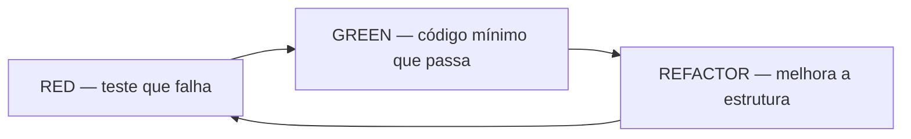
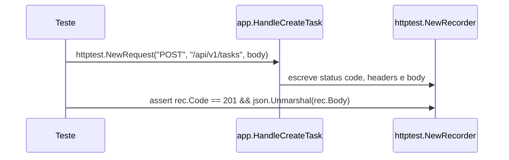
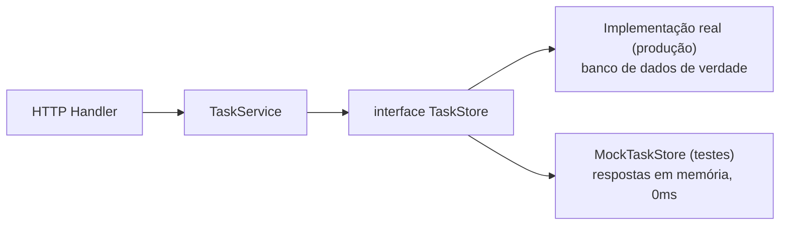

Os posts anteriores desta série cobriram os fundamentos da linguagem e como escrever código concorrente correto. Mas nenhum dos dois vale muito sem uma rede de segurança: como você sabe que o código continua funcionando depois da próxima mudança?

Este guia cobre testes automatizados em Go do começo ao fim — por que testamos, o pacote `testing` nativo, TDD na prática, como testar handlers HTTP sem subir um servidor, como desacoplar código com interfaces para torná-lo testável, mocks (manuais e automáticos), table-driven tests, subtestes paralelos, fuzzing, benchmarks e cobertura de código.

---

## 1. Fundamentos: Por que Testamos? Refatoração & Código Legado

Quando você escreve uma funcionalidade nova, o código está fresco na sua memória: você sabe onde cada variável muda, quais funções têm efeitos colaterais, o que pode quebrar. Essa sensação de controle é passageira. Em semanas o contexto começa a esvair; em meses, você já não confia mais no próprio código. Seis meses depois, é "código legado" — e o instinto mais comum é reescrever do zero, o que só reinicia o ciclo: o código novo também vira legado, e a única coisa que mudou foi o tempo e o dinheiro gastos no meio do caminho.

Por trás desse ciclo estão quatro desafios que se repetem em praticamente todo sistema que sobrevive tempo suficiente:

| Desafio | Causa raiz | Solução de engenharia |
| :--- | :--- | :--- |
| **Complexidade inerente** | Regras de negócio densas, integrações múltiplas, efeitos colaterais em cascata. | Decomposição modular + testes automatizados de comportamento. |
| **Baixa legibilidade** | Funções gigantescas, nomes crípticos, acoplamento excessivo. | Refatoração contínua respaldada por uma suíte de testes verde. |
| **Mudança contínua de requisitos** | O negócio muda; software que não muda morre. | Arquitetura desacoplada, com interfaces bem definidas. |
| **Bugs e regressões** | Corrigir A introduz silenciosamente B em outra parte do sistema. | Testes de regressão automatizados a cada commit. |

Isso nos leva à definição correta de **Refatoração**. O termo é usado de forma errada o tempo todo — "o sistema vai ficar quebrado essa semana porque estamos refatorando" não é refatoração, é reescrita. Martin Fowler define com precisão, em *Refactoring: Improving the Design of Existing Code*:

> *"Refatoração é o processo de alterar a estrutura interna de um software para torná-lo mais fácil de entender e mais barato de modificar, sem alterar o seu comportamento observável externo."*

É a mesma lógica de fatorar uma expressão matemática: `1/2 + 1/4` e `2/4 + 1/4` chegam ao mesmo `3/4` por caminhos internos diferentes. A representação muda; o resultado observável, não.

### O caso prático da função palíndromo

Um palíndromo é uma palavra ou frase idêntica lida de trás para frente (`"aba"`, `"racecar"`, `"radar"`). Veja duas implementações completamente diferentes para o mesmo problema:

```go title="palindrome.go"
package palindrome

// IsPalindrome verifica se uma string é palíndromo comparando os extremos
func IsPalindrome(s string) bool {
    n := len(s)
    for i := 0; i < n/2; i++ {
        if s[i] != s[n-1-i] {
            return false // Caracteres das pontas não coincidem
        }
    }
    return true
}
```

```go title="palindrome_refactored.go"
package palindrome

// IsPalindromeRefactored inverte a string e compara com a original
func IsPalindromeRefactored(s string) bool {
    runes := []rune(s)
    for i, j := 0, len(runes)-1; i < j; i, j = i+1, j-1 {
        runes[i], runes[j] = runes[j], runes[i]
    }
    return string(runes) == s
}
```

Como ter certeza de que as duas produzem exatamente o mesmo resultado para strings vazias, caracteres Unicode, tamanhos par e ímpar? Sem testes automatizados, você apenas espera que funcione. Com eles, você prova que funciona a cada compilação. A sintaxe exata do arquivo abaixo — o sufixo `_test.go`, o parâmetro `t *testing.T`, o método `t.Errorf` — é formalizada na seção 2; por enquanto, repare só na lógica: uma tabela de casos de entrada e saída esperada, comparados um a um:

```go title="palindrome_test.go"
package palindrome

import "testing"

func TestIsPalindrome(t *testing.T) {
    tests := []struct {
        input    string
        expected bool
    }{
        {input: "aba", expected: true},
        {input: "racecar", expected: true},
        {input: "radar", expected: true},
        {input: "golang", expected: false},
        {input: "", expected: true},
        {input: "a", expected: true},
    }

    for _, tc := range tests {
        got := IsPalindrome(tc.input)
        if got != tc.expected {
            t.Errorf("IsPalindrome(%q) = %t; esperado %t", tc.input, got, tc.expected)
        }
    }
}
```

Vale notar também que esse mesmo arquivo `_test.go` funciona como **documentação viva**: diferente de um wiki ou README manual, que apodrece silenciosamente quando ninguém atualiza a regra de negócio, o teste é código compilado. Se o comportamento mudar e o teste não acompanhar, o build quebra no CI — é a única documentação que não pode mentir.

### O ciclo TDD: Red, Green, Refactor

TDD (*Test-Driven Development*) é a prática de escrever o teste antes do código de produção, em ciclos curtos. A ideia é simples: você não escreve uma linha de lógica sem antes ter uma forma automática de provar que ela funciona. O ciclo tem três passos, que se repetem indefinidamente:



1. **RED:** escreva um teste para uma função que ainda não existe ou não trata aquele caso. Ele falha, obrigatoriamente.
2. **GREEN:** escreva a menor quantidade de código de produção necessária para o teste passar. Nada além disso.
3. **REFACTOR:** com a barra verde garantida, limpe o código — remova acoplamento, renomeie, otimize — sabendo que qualquer regressão vai aparecer na hora.

### O checklist do que nunca deixar de testar

- **Valores extremos e bordas:** strings vazias e gigantescas, caracteres Unicode/emoji, zero, negativos, `MaxInt`/`MinInt`, slices e maps vazios ou `nil`.
- **Validação de inputs:** e-mails malformados, JSON truncado, datas inválidas.
- **Data races:** rode a suíte sob concorrência com `go test -race`.
- **Efeitos colaterais:** o estado do banco mudou corretamente? os eventos dependentes saíram na ordem certa?
- **Fuzzing:** bombardeie a função com entradas aleatórias e caóticas para achar crashes que você não previu.

### Testes transparentes (white-box) vs. testes opacos (black-box)

Pense num restaurante: um teste white-box é como entrar na cozinha e checar cada panela; um teste black-box é como um cliente comum, que só vê o prato chegando na mesa e julga pelo resultado. Em Go, essa distinção é controlada pela própria declaração do `package`:

- **White-box (`package auth`):** o arquivo de teste vive no mesmo pacote do código-fonte e enxerga tudo, inclusive funções privadas. Bom para algoritmos internos complexos.
- **Black-box (`package auth_test`):** pacote de teste externo, sufixo `_test`, só enxerga a API pública. Evita acoplamento com detalhes de implementação e testa exatamente como um cliente real consome o pacote.

:::tip[Boas práticas de design em Go]
Dê preferência quase absoluta a testes opacos (`package foo_test`). Eles garantem que sua suíte não dependa de implementação interna volátil — você pode refatorar o código privado sem quebrar nenhum teste existente.
:::

Um teste unitário também é, na prática, o contrato formal de comportamento que seu pacote assina com o resto do sistema. Brian Kernighan (co-autor de *The Go Programming Language*) resume o risco de fazer isso mal:

> *"Os bugs mais difíceis de resolver são aqueles em que o seu modelo mental da situação está errado. Dessa forma, achar o problema se torna impossível."*

O erro comum é escrever testes só para confirmar que o código que você acabou de escrever funciona — o que apenas repete a mesma ideia (possivelmente errada) que você já tinha na cabeça quando escreveu o código. A postura certa é tentar quebrar o programa: procurar ativamente o caso que sua lógica não previu, antes que o usuário o encontre em produção. Dá pra pensar em graus de "quão correto" um software é, numa escala que vai de "compila e não quebra ao ligar" até "trata 100% dos casos de erro previstos na especificação" — sistemas profissionais de alta criticidade miram no meio-para-cima dessa escala, não nos extremos.

### A falácia dos 100% de code coverage

Muita equipe exige 100% de cobertura no CI acreditando que isso garante zero bugs. Não garante, por três razões:

1. Cobertura mede **linhas executadas**, não comportamento correto — um teste pode passar por 100% do código sem fazer nenhum assert semântico relevante.
2. Você pode cobrir 100% do código implementando a regra de negócio **errada**. Cobertura não sabe se a lógica está certa, só se ela rodou.
3. Código que você esqueceu de escrever não pode ser coberto. Se faltou uma validação de segurança, a cobertura continua em 100% e a vulnerabilidade continua ativa.

:::note[Faixa saudável da indústria]
75% a 85% de cobertura, com foco no core de negócio, algoritmos críticos e bordas. O esforço para ir de 85% a 100% custa caro e geralmente só testa getters triviais e boilerplate inócuo — retorno decrescente.
:::

---

## 2. O Pacote Nativo `testing` & Anatomia de um Teste em Go

Go traz uma das melhores ferramentas de teste nativas do mercado: o pacote `testing` e o comando `go test`. Diferente de Java (JUnit) ou JavaScript (Jest/Mocha), você não instala nenhuma biblioteca externa para escrever testes de nível mundial.

### Convenções de nomenclatura

O compilador e o test runner impõem três regras:

1. **Arquivo:** precisa terminar em `_test.go` (ex: `tasks_handlers.go` → `tasks_handlers_test.go`). O compilador de produção ignora esses arquivos por completo.
2. **Função:** precisa começar com `Test` maiúsculo seguido de nome descritivo (`func TestHandleCreateTask(t *testing.T)`).
3. **Parâmetro:** único, obrigatoriamente `t *testing.T`.

### `*testing.T`: `Errorf`, `Fatalf` e `Logf`

Você já viu `t.Errorf` em ação no teste do palíndromo (seção 1). A tabela abaixo mostra os três métodos de `*testing.T` que fazem o trabalho de reportar o resultado de um teste:

| Método | Comportamento | Quando usar |
| :--- | :--- | :--- |
| `t.Errorf(...)` | Marca o teste como falho, mas **continua** executando as linhas seguintes. | Comparações independentes — permite ver todos os erros de uma vez. |
| `t.Fatalf(...)` | Marca como falho e **aborta imediatamente** o teste atual. | Falhas catastróficas que impedem continuar (parse de JSON quebrado, ponteiro nil, erro de banco). |
| `t.Logf(...)` | Registra mensagens e payloads informativos. | Só aparece quando o teste falha, ou com a flag `-v`. |

### Comandos essenciais

```bash
# Executa todos os testes do projeto, recursivamente:
go test ./...

# Saída detalhada de logs (t.Logf):
go test -v ./...

# Executa apenas uma função de teste específica (por regex):
go test -v -run TestHandleCreateTask ./internal/api/...

# Checa condições de corrida concorrente (data races):
go test -race ./...

# Exibe a porcentagem de cobertura de código:
go test -cover ./...
```

---

## 3. Testando Handlers HTTP Unitariamente com `net/http/httptest` & TDD (Fase RED)

Testar um endpoint HTTP não deveria exigir subir um servidor real nem ocupar portas de rede. Um handler em Go é só uma função com a assinatura `func(w http.ResponseWriter, r *http.Request)` — não há nada de especial numa conexão de rede que ele realmente precise. O pacote nativo `net/http/httptest` explora exatamente isso: `httptest.NewRequest` monta um `*http.Request` válido sem abrir socket nenhum, e `httptest.NewRecorder` devolve um *ResponseRecorder* — um struct que implementa `http.ResponseWriter` e grava em memória tudo que o handler escreveria numa resposta real (status code, headers, corpo). O teste chama o handler direto e inspeciona o que foi gravado:



### O Teste Escrito Antes do Handler (Fase RED)

Seguindo TDD rigoroso, escrevemos o teste — e o contrato de resposta esperado — antes de existir qualquer implementação. Os handlers vivem como métodos de uma struct `Application`, que por enquanto não precisa de mais nada além de existir — ela vai ganhar campos reais (como a camada de serviço da próxima seção) só quando o handler realmente precisar deles:

```go title="internal/api/api.go"
package api

// Application centraliza as dependências dos handlers HTTP
type Application struct{}
```

```go title="internal/api/tasks_handlers_test.go"
package api

import (
    "bytes"
    "encoding/json"
    "net/http"
    "net/http/httptest"
    "testing"
)

func TestHandleCreateTask(t *testing.T) {
    // 1. SETUP: Instancia a aplicação em memória
    app := Application{}

    // 2. ARRANGE: Prepara o payload JSON de entrada
    payload := map[string]any{
        "title":       "Aprender TDD em Go",
        "description": "Praticar testes com net/http/httptest",
        "priority":    9000,
    }

    bodyBytes, err := json.Marshal(payload)
    if err != nil {
        t.Fatalf("falha ao serializar payload: %v", err)
    }

    // 3. Cria a requisição HTTP em memória
    req := httptest.NewRequest(http.MethodPost, "/api/v1/tasks", bytes.NewReader(bodyBytes))
    req.Header.Set("Content-Type", "application/json")

    // 4. Cria o gravador de resposta (ResponseRecorder)
    rec := httptest.NewRecorder()

    // 5. ACT: Invoca diretamente o handler usando ServeHTTP
    handler := http.HandlerFunc(app.HandleCreateTask)
    handler.ServeHTTP(rec, req)

    // 6. ASSERT: Valida o Status Code (esperado: 201 Created)
    if rec.Code != http.StatusCreated {
        t.Errorf("Status Code incorreto: obteve %d; esperava %d", rec.Code, http.StatusCreated)
    }

    // 7. ASSERT: Valida o corpo JSON da resposta retornada
    var resBody map[string]any
    if err := json.Unmarshal(rec.Body.Bytes(), &resBody); err != nil {
        t.Fatalf("falha ao decodificar JSON de resposta (%q): %v", rec.Body.String(), err)
    }

    if resBody["title"] != payload["title"] {
        t.Errorf("Título incorreto: obteve %q; esperava %q", resBody["title"], payload["title"])
    }
}
```

### O Handler Inicial (Vazio)

O handler começa deliberadamente vazio, só para observarmos a falha:

```go title="internal/api/tasks_handlers.go"
package api

import (
    "net/http"
)

// HandleCreateTask processa a criação de uma nova task
func (app *Application) HandleCreateTask(w http.ResponseWriter, r *http.Request) {
    // Função deliberadamente vazia para observar o teste falhar na fase RED
}
```

### A Prova da Falha

Rodando `go test -v ./internal/api/...`, a falha é cirúrgica:

```text
=== RUN   TestHandleCreateTask
    tasks_handlers_test.go:34: Status Code incorreto: obteve 200; esperava 201
    tasks_handlers_test.go:40: falha ao decodificar JSON de resposta (""): unexpected end of JSON input
--- FAIL: TestHandleCreateTask (0.00s)
FAIL
FAIL    github.com/user/taskify/internal/api    0.003s
```

:::tip[O valor do estado RED]
A falha comprova que o teste é honesto e não está passando por engano (*falso positivo*). No próximo passo, implementamos o código mínimo de produção para chegar à fase GREEN.
:::

---

## 4. Desacoplamento com Interfaces & A Camada de Domínio (`TaskStore` & `TaskService`)

Para sair do RED e chegar ao GREEN, o handler vai precisar buscar e salvar tasks de verdade — e isso levanta uma pergunta de design antes de qualquer linha de código: como o handler deve falar com o banco de dados sem tornar impossível testar tudo de novo em milissegundos? Pense em ligar um aparelho numa tomada de parede em vez de soldar os fios direto na rede elétrica da casa: qualquer aparelho com o plugue certo funciona ali, e você pode trocar de aparelho sem tocar na parede. É essa a ideia por trás de programar contra uma interface em vez de um banco de dados concreto. O `TaskService` não sabe — nem precisa saber — se do outro lado tem um Postgres de verdade ou uma versão falsa criada só para teste; ele enxerga apenas o "plugue": a interface `TaskStore`. É isso que torna possível testar a lógica de negócio em milissegundos, sem subir banco nenhum.

Essa ideia tem um nome formal — Inversão de Dependência (*Dependency Inversion Principle*) — mas o resumo é simples: camadas de alto nível (handlers, serviços) nunca devem depender de detalhes concretos de infraestrutura, como um cliente de banco específico; só de interfaces abstratas.



### O Contrato de Persistência: `store.TaskStore`

No pacote `store`, definimos a entidade de domínio e o contrato de métodos — a "lista de plugues" que qualquer implementação precisa oferecer. Regra de ouro: toda operação de I/O recebe `ctx context.Context` como primeiro parâmetro, para poder ser cancelada ou receber um timeout de fora, vindo do handler HTTP.

```go title="internal/store/task_store.go"
package store

import (
    "context"
    "time"
)

// Task representa a entidade de domínio de uma tarefa no sistema
type Task struct {
    ID          int32     `json:"id"`
    Title       string    `json:"title"`
    Description string    `json:"description"`
    Priority    int32     `json:"priority"`
    CreatedAt   time.Time `json:"created_at"`
    UpdatedAt   time.Time `json:"updated_at"`
}

// TaskStore define o contrato de persistência independente do driver ou banco utilizado
type TaskStore interface {
    CreateTask(ctx context.Context, title, description string, priority int32) (Task, error)
    GetTaskByID(ctx context.Context, id int32) (Task, error)
    ListTasks(ctx context.Context) ([]Task, error)
    UpdateTask(ctx context.Context, id int32, title, description string, priority int32) (Task, error)
    DeleteTask(ctx context.Context, id int32) error
}
```

### Quem implementa o plugue não importa para o teste

Alguma implementação concreta de `TaskStore` vai existir em produção — hoje pode ser Postgres, amanhã outro banco, sem que `TaskService` precise mudar uma linha. Como ela funciona por dentro (driver, biblioteca de acesso a dados, mapeamento de colunas) é um assunto de infraestrutura, não de testes, e fica fora do escopo deste guia. O que importa aqui é só isso: **para testar `TaskService`, você nunca precisa dessa implementação real** — só de algo que satisfaça a interface, o que nos leva à versão falsa usada em teste.

### A Camada de Serviço: `TaskService`

O `TaskService` recebe o `ctx` propagado pelo handler e o repassa direto para a store, aplicando as validações de domínio no meio do caminho:

```go title="internal/services/task_service.go"
package services

import (
    "context"
    "errors"
    "strings"

    "github.com/user/taskify/internal/store"
)

var (
    ErrInvalidTitle    = errors.New("o título da tarefa não pode ser vazio")
    ErrInvalidPriority = errors.New("a prioridade deve ser maior ou igual a zero")
)

type TaskService struct {
    store store.TaskStore
}

func NewTaskService(store store.TaskStore) *TaskService {
    return &TaskService{
        store: store,
    }
}

func ValidateTask(title string, priority int32) error {
    if strings.TrimSpace(title) == "" {
        return ErrInvalidTitle
    }
    if priority < 0 {
        return ErrInvalidPriority
    }
    return nil
}

func (s *TaskService) CreateTask(ctx context.Context, title, description string, priority int32) (store.Task, error) {
    if err := ValidateTask(title, priority); err != nil {
        return store.Task{}, err
    }
    return s.store.CreateTask(ctx, title, description, priority)
}

func (s *TaskService) GetTask(ctx context.Context, id int32) (store.Task, error) {
    return s.store.GetTaskByID(ctx, id)
}

func (s *TaskService) ListTasks(ctx context.Context) ([]store.Task, error) {
    return s.store.ListTasks(ctx)
}

func (s *TaskService) UpdateTask(ctx context.Context, id int32, title, description string, priority int32) (store.Task, error) {
    if err := ValidateTask(title, priority); err != nil {
        return store.Task{}, err
    }
    return s.store.UpdateTask(ctx, id, title, description, priority)
}

func (s *TaskService) DeleteTask(ctx context.Context, id int32) error {
    return s.store.DeleteTask(ctx, id)
}
```

### Testes Unitários vs. Testes de Integração

Essa separação em camadas resolve o dilema clássico dos testes automatizados. Testes unitários puros — a função `ValidateTask`, o `TaskService` com um mock — rodam em menos de 1 milissegundo e cobrem dezenas de cenários de borda sem tocar em banco nenhum. Testes de integração validam se a implementação real do `TaskStore` realmente funciona contra um banco de verdade, e por isso exigem infraestrutura rodando. Os dois têm seu lugar: muitos testes unitários rápidos, e uma suíte menor de integração para o que só o banco real pode confirmar.

### Quanto Mockar: o Debate "I Mock, You Mock"

O artigo clássico *I Mock, You Mock* resume bem quando usar mocks: para isolar a unidade sob teste de dependências lentas ou externas (bancos, APIs de terceiros, gateways de pagamento), e para simular cenários difíceis de forçar de verdade (banco fora do ar, timeout de conexão, chave primária duplicada). O risco é o *over-mocking* — mockar tudo acaba testando a implementação do mock, não o comportamento do software. Regra prática: use mocks nos testes unitários de handlers e serviços, e mantenha uma suíte menor de integração com banco real para validar o schema SQL.

---

## 5. Mocks Manuais em Go, O Padrão AAA & Asserts com `testify/assert`

Nesta seção aplicamos Mocking Manual em memória para testar as regras de negócio do `TaskService` sem depender de banco de dados, seguindo o padrão universal **AAA** (*Arrange - Act - Assert*).

### O Padrão AAA (Arrange - Act - Assert)

Sem uma estrutura, um teste vira facilmente uma mistura confusa de preparação, chamada e verificação — difícil de ler seis meses depois, e ainda mais difícil de saber o que exatamente quebrou quando ele falha. O AAA resolve isso separando qualquer teste em três blocos bem demarcados, sempre na mesma ordem:

- **Arrange** (preparar): instancia o mock, injeta no serviço, define a entrada e o resultado esperado.
- **Act** (agir): invoca o método sob teste — só essa uma linha é o que está de fato sendo testado.
- **Assert** (verificar): checa se não houve erro inesperado e se o retorno bate com a expectativa.

O ganho é simples: qualquer pessoa lendo o teste — inclusive você, no futuro — sabe exatamente onde termina o "contexto" e começa a "coisa testada de verdade". É o mesmo esqueleto dos comentários numerados no teste RED da seção 3, agora aplicado à camada de serviço.

### Construindo Mocks Manuais (`MockTaskStore`)

Em Go, qualquer struct que implemente todos os métodos de `store.TaskStore` satisfaz o contrato automaticamente (*duck typing* estrutural) — não existe palavra-chave especial para "mock" na linguagem. Um mock é exatamente isso: uma struct escrita à mão que implementa a mesma interface da versão real, mas devolve valores fixos e previsíveis em vez de consultar um banco de verdade. O mock abaixo é uma implementação fake em memória, com suporte a `context.Context`:

```go title="internal/services/task_service_test.go"
package services

import (
    "context"
    "testing"
    "time"

    "github.com/stretchr/testify/assert"
    "github.com/user/taskify/internal/store"
)

// mockTaskStore é a implementação fake da interface store.TaskStore em memória
type mockTaskStore struct{}

func (m *mockTaskStore) CreateTask(ctx context.Context, title, description string, priority int32) (store.Task, error) {
    return store.Task{
        ID:          1,
        Title:       title,
        Description: description,
        Priority:    priority,
        CreatedAt:   time.Now(),
        UpdatedAt:   time.Now(),
    }, nil
}

func (m *mockTaskStore) GetTaskByID(ctx context.Context, id int32) (store.Task, error) {
    return store.Task{
        ID:          id,
        Title:       "Mock Task",
        Description: "Mock Description",
        Priority:    1,
        CreatedAt:   time.Now(),
        UpdatedAt:   time.Now(),
    }, nil
}

func (m *mockTaskStore) ListTasks(ctx context.Context) ([]store.Task, error) {
    return []store.Task{
        {
            ID:          1,
            Title:       "Task 1",
            Description: "Description 1",
            Priority:    1,
            CreatedAt:   time.Now(),
            UpdatedAt:   time.Now(),
        },
        {
            ID:          2,
            Title:       "Task 2",
            Description: "Description 2",
            Priority:    2,
            CreatedAt:   time.Now(),
            UpdatedAt:   time.Now(),
        },
    }, nil
}

func (m *mockTaskStore) UpdateTask(ctx context.Context, id int32, title, description string, priority int32) (store.Task, error) {
    return store.Task{
        ID:          id,
        Title:       title,
        Description: description,
        Priority:    priority,
        CreatedAt:   time.Now(),
        UpdatedAt:   time.Now(),
    }, nil
}

func (m *mockTaskStore) DeleteTask(ctx context.Context, id int32) error {
    return nil // Simula deleção com sucesso
}
```

### Testando o `TaskService` com Mocks

```go title="internal/services/task_service_test.go (continuação)"
// Teste de Criação de Tarefa
func TestTaskService_CreateTask(t *testing.T) {
    // 1. ARRANGE
    mockStore := &mockTaskStore{}
    service := NewTaskService(mockStore)
    ctx := context.Background()

    expectedTitle := "Aprender TDD"
    expectedDesc := "Escrever testes com mocks em Go"
    expectedPriority := int32(10)

    // 2. ACT
    task, err := service.CreateTask(ctx, expectedTitle, expectedDesc, expectedPriority)

    // 3. ASSERT
    assert.NoError(t, err)
    assert.Equal(t, expectedTitle, task.Title)
    assert.Equal(t, expectedDesc, task.Description)
    assert.Equal(t, expectedPriority, task.Priority)
    assert.Equal(t, int32(1), task.ID)
}

// Teste de Busca por ID
func TestTaskService_GetTask(t *testing.T) {
    // 1. ARRANGE
    mockStore := &mockTaskStore{}
    service := NewTaskService(mockStore)
    ctx := context.Background()

    // 2. ACT
    task, err := service.GetTask(ctx, 1)

    // 3. ASSERT
    assert.NoError(t, err)
    assert.Equal(t, int32(1), task.ID)
    assert.Equal(t, "Mock Task", task.Title)
}

// Teste de Listagem de Tarefas
func TestTaskService_ListTasks(t *testing.T) {
    // 1. ARRANGE
    mockStore := &mockTaskStore{}
    service := NewTaskService(mockStore)
    ctx := context.Background()

    // 2. ACT
    tasks, err := service.ListTasks(ctx)

    // 3. ASSERT
    assert.NoError(t, err)
    assert.Len(t, tasks, 2)
    assert.Equal(t, "Task 1", tasks[0].Title)
    assert.Equal(t, "Task 2", tasks[1].Title)
}
```

### `testify/assert` vs. Standard Library

O pacote `github.com/stretchr/testify/assert` é o mais popular do ecossistema Go para asserções de teste:

| Operação | Com `testify/assert` | Com Standard Library Pura |
| :--- | :--- | :--- |
| **Checagem de Erro** | `assert.NoError(t, err)` | `if err != nil { t.Fatalf("erro inesperado: %v", err) }` |
| **Igualdade Estrita** | `assert.Equal(t, want, got)` | `if got != want { t.Errorf("obteve %v, esperava %v", got, want) }` |
| **Comparação de Structs** | `assert.Equal(t, wantTask, gotTask)` | `if !reflect.DeepEqual(gotTask, wantTask) { t.Errorf(...) }` |
| **Tamanho de Slice** | `assert.Len(t, tasks, 2)` | `if len(tasks) != 2 { t.Errorf("tamanho incorreto: %d", len(tasks)) }` |
| **Diff Visual em Falhas** | Imprime diff colorido estruturado (*"Diff: -want +got"*) | Exige formatação manual com `fmt.Sprintf` |

```bash
go test -v ./internal/services/...

# === RUN   TestTaskService_CreateTask
# --- PASS: TestTaskService_CreateTask (0.00s)
# === RUN   TestTaskService_GetTask
# --- PASS: TestTaskService_GetTask (0.00s)
# === RUN   TestTaskService_ListTasks
# --- PASS: TestTaskService_ListTasks (0.00s)
# PASS
# ok      github.com/user/taskify/internal/services    0.002s
```

:::caution[Não deixe o mock ficar esperto demais]
Colocar validações de string, filtros SQL ou lógica de negócio dentro do `mockTaskStore` é um erro clássico — você acaba testando o mock, não o `TaskService`. O mock deve ser burro e previsível: recebe parâmetros, devolve uma struct estática. Toda a inteligência mora no serviço.
:::

---

## 6. Table-Driven Tests e o Padrão `got`/`want`

Imagine testar uma função de saudação em quatro idiomas escrevendo `TestSaudacaoIngles`, `TestSaudacaoPortugues`, `TestSaudacaoEspanhol`... Cada função repete a mesma estrutura, só muda o dado de entrada e o resultado esperado. É código duplicado disfarçado de teste.

A solução idiomática em Go é o **Table-Driven Test**: uma única função de teste, e uma tabela (um slice) com todos os casos. Um loop percorre a tabela e roda a mesma lógica de verificação para cada linha. Adicionar um novo caso vira uma linha a mais na tabela, não uma função nova.

### O padrão `got` vs `want`

Dentro desse loop, a comunidade padronizou dois nomes de variável: `got` é o que a função realmente retornou, `want` é o que ela deveria ter retornado. Comparar os dois e reportar a diferença é o coração de qualquer teste manual:

```go
if got != want {
    t.Errorf("got %q, want %q", got, want)
}
```

Use sempre `%q` (e não `%s`) para strings em mensagens de erro. `%q` adiciona aspas e escapa caracteres de controle — se a função retornar `"Hello "` com um espaço extra, `%s` esconderia o problema, mas `%q` mostraria `got "Hello ", want "Hello"` imediatamente.

### Anatomia com structs anônimas

A tabela é um slice de structs anônimas:

```go
tests := []struct {
    name  string // nome descritivo do caso
    input string // dado de entrada
    want  string // saída esperada
}{
    {name: "saudação em português", input: "pt", want: "Oi"},
    {name: "saudação em inglês", input: "en", want: "Hello"},
}
```

Com a tabela pronta, o loop prometido lá em cima fica direto: para cada linha, chama a função testada e reaplica a mesma comparação `got`/`want`:

```go
for _, tc := range tests {
    got := saudacao(tc.input)
    if got != tc.want {
        t.Errorf("%s: got %q, want %q", tc.name, got, tc.want)
    }
}
```

Funciona, mas todas as falhas caem no mesmo `t.Errorf` — para saber qual linha da tabela quebrou, é preciso ler o `tc.name` embutido na mensagem à mão. A seção 7 resolve isso.

### A pasta `testdata/`

Quando os dados de um caso de teste crescem além do que cabe numa struct — um JSON de payload, uma resposta HTTP gravada, um certificado —, embuti-los como string literal na tabela fica ilegível. Qualquer diretório chamado `testdata/` dentro de um pacote é ignorado pelo `go build`, mas fica disponível para os arquivos `*_test.go`. É o lugar certo para essas fixtures:

```
internal/parser/
├── parser.go
├── parser_test.go
└── testdata/
    ├── valid_payload.json      <- os.ReadFile("testdata/valid_payload.json")
    └── corrupted_payload.json
```

### Cache de testes

Outra conveniência do `go test`, útil à medida que a suíte cresce: ele mantém cache dos resultados. Se nada mudou desde a última execução, o pacote aparece como `(cached)` em vez de rodar de novo.

```bash
go test ./...
# ok  github.com/user/project/pkg  (cached)

go clean -testcache        # limpa o cache manualmente
go test -count=1 ./...     # força execução sem cache
```

---

## 7. Subtestes com `t.Run`, Execução Paralela e o Ciclo TDD

No loop que fechou a seção anterior, uma falha só apontava o caso certo se você tivesse embutido `tc.name` na mensagem de erro à mão. `t.Run(name, func(t *testing.T))` resolve isso automaticamente: executa cada linha da tabela como um subteste independente, com nome próprio na árvore de execução.

### Subtestes isolados com `t.Run`

Basta envolver o corpo do loop com `t.Run`, usando `tc.name` como identificador:

```go
for _, tc := range tests {
    t.Run(tc.name, func(t *testing.T) {
        got := saudacao(tc.input)
        if got != tc.want {
            t.Errorf("got %q, want %q", got, tc.want)
        }
    })
}
```

Agora uma falha já aparece na saída identificada pelo nome do subteste (`--- FAIL: NomeDoTeste/NomeDoCaso`), sem precisar embutir `tc.name` na mensagem manualmente. O nome também serve para filtrar execuções pela CLI e rodar um único caso, sem disparar a suíte inteira — como no exemplo `HelloName` que fecha esta seção:

```bash
go test -v -run "TestHelloName/SpanishGreet" ./internal/greet/...
```

### Execução concorrente com `t.Parallel()`

Numa suíte com dezenas de subtestes, rodar cada um em sequência desperdiça tempo se eles não dependem uns dos outros. Chame `t.Parallel()` dentro do `t.Run` e o subteste passa a rodar concorrentemente com os demais marcados da mesma forma — a suíte inteira termina mais rápido. Isso só é seguro se os subtestes forem independentes e não compartilharem estado mutável; aliás, rodar em paralelo também é uma forma de expor bugs de concorrência que já existiam no código testado e ficavam escondidos enquanto tudo rodava em sequência.

```go
func TestParallelSuite(t *testing.T) {
    tests := []struct {
        name string
    }{
        {name: "caso 1"},
        {name: "caso 2"},
    }

    for _, tc := range tests {
        t.Run(tc.name, func(t *testing.T) {
            t.Parallel() // permite que este subteste rode concorrentemente
            // asserções...
        })
    }
}
```

Ao usar `tc` (a variável do loop) dentro da closure passada para `t.Run`, é preciso ter cuidado com o escopo dela:

:::note[Por que "cuidado com o escopo"?]
`t.Parallel()` faz o subteste pausar e só continuar depois que a função `TestParallelSuite` inteira já terminou de disparar todos os outros. O problema: antes do Go 1.22, a variável `tc` do loop era uma única caixa reaproveitada a cada volta — não uma caixa nova por iteração. Se os subtestes só rodam de verdade depois que o loop já acabou, todos acabavam lendo o valor que sobrou na caixa: o da última iteração. Resultado: vários subtestes com nomes diferentes, todos testando o mesmo caso. Desde o Go 1.22, cada volta do `for` ganha sua própria caixa, e esse cuidado não é mais necessário.
:::

### O ciclo TDD na prática: `HelloName` multi-idioma

Table-driven tests e subtestes se encaixam perfeitamente no ciclo Red → Green → Refactor. Vamos construir uma função de saudação multi-idioma do zero.

#### Red: a tabela de casos de borda

```go title="internal/greet/hello_test.go"
package greet

import (
    "testing"
)

func TestHelloName(t *testing.T) {
    tests := []struct {
        name     string
        language string
        input    string
        want     string
    }{
        {
            name:     "EnglishGreet",
            language: "en",
            input:    "John",
            want:     "Hello, John",
        },
        {
            name:     "PortugueseGreet",
            language: "pt",
            input:    "Maria",
            want:     "Oi, Maria",
        },
        {
            name:     "SpanishGreet",
            language: "es",
            input:    "Carlos",
            want:     "Hola, Carlos",
        },
        {
            name:     "FrenchGreet",
            language: "fr",
            input:    "Pierre",
            want:     "Bonjour, Pierre",
        },
        {
            name:     "EmptyStringName",
            language: "pt",
            input:    "",
            want:     "Oi, Anonymous",
        },
        {
            name:     "EmptyLanguage",
            language: "",
            input:    "Loran",
            want:     "👋, Loran",
        },
        {
            name:     "InvalidLanguage",
            language: "ru",
            input:    "Loran",
            want:     "👋, Loran",
        },
    }

    for _, tc := range tests {
        t.Run(tc.name, func(t *testing.T) {
            got := HelloName(tc.input, tc.language)
            if got != tc.want {
                t.Errorf("got %q, want %q", got, tc.want)
            }
        })
    }
}
```

`HelloName` ainda não existe, então cada subteste falha com precisão — fase Red.

#### Green: implementação ingênua

O jeito mais rápido de sair do vermelho é uma cadeia de `if/else`:

```go title="internal/greet/hello.go (fase Green)"
package greet

import "fmt"

func HelloName(name, lang string) string {
    if name == "" {
        name = "Anonymous"
    }

    if lang == "en" {
        return fmt.Sprintf("Hello, %s", name)
    }
    if lang == "pt" {
        return fmt.Sprintf("Oi, %s", name)
    }
    if lang == "es" {
        return fmt.Sprintf("Hola, %s", name)
    }
    if lang == "fr" {
        return fmt.Sprintf("Bonjour, %s", name)
    }

    return fmt.Sprintf("👋, %s", name)
}
```

Rodando `go test ./internal/greet/...`, tudo passa — fase Green.

#### Refactor: mapa em vez de ifs

Com a suíte verde nos protegendo, trocamos a cadeia de ifs por um mapa em nível de pacote, mais fácil de estender para novos idiomas:

```go title="internal/greet/hello.go (fase Refactor)"
package greet

import "fmt"

const (
    defaultGreet = "👋"
    defaultName  = "Anonymous"
)

// greetings armazena o mapa de saudações por idioma
var greetings = map[string]string{
    "pt": "Oi",
    "en": "Hello",
    "es": "Hola",
    "fr": "Bonjour",
}

// HelloName formata uma saudação amigável no idioma especificado
func HelloName(name, lang string) string {
    if name == "" {
        name = defaultName
    }

    greet, ok := greetings[lang]
    if !ok || lang == "" {
        greet = defaultGreet
    }

    return fmt.Sprintf("%s, %s", greet, name)
}
```

```bash
go test -v ./internal/greet/...

# === RUN   TestHelloName
# === RUN   TestHelloName/EnglishGreet
# === RUN   TestHelloName/PortugueseGreet
# === RUN   TestHelloName/SpanishGreet
# === RUN   TestHelloName/FrenchGreet
# === RUN   TestHelloName/EmptyStringName
# === RUN   TestHelloName/EmptyLanguage
# === RUN   TestHelloName/InvalidLanguage
# --- PASS: TestHelloName (0.00s)
#     --- PASS: TestHelloName/EnglishGreet (0.00s)
#     --- PASS: TestHelloName/PortugueseGreet (0.00s)
#     --- PASS: TestHelloName/SpanishGreet (0.00s)
#     --- PASS: TestHelloName/FrenchGreet (0.00s)
#     --- PASS: TestHelloName/EmptyStringName (0.00s)
#     --- PASS: TestHelloName/EmptyLanguage (0.00s)
#     --- PASS: TestHelloName/InvalidLanguage (0.00s)
# PASS
# ok      github.com/user/project/internal/greet    0.002s
```

---

## 8. Mocks Automáticos com `mockery` & `gomock`

A ideia por trás dessas ferramentas é simples: em vez de você escrever o mock à mão como na seção 5, uma ferramenta lê a interface e escreve o mock por você. Funciona bem enquanto a interface é pequena, como `TaskStore` com dois ou três métodos. Mas em um projeto real, com dezenas de interfaces ganhando métodos novos com o tempo, manter todos os mocks manuais atualizados vira trabalho repetitivo — e trabalho repetitivo é exatamente o que dá para automatizar.

Os dois geradores mais usados no ecossistema Go são:

- **`mockery`** (`vektra/mockery`): lê uma interface Go e gera automaticamente uma struct mock compatível com `testify/mock`, controlada por uma API declarativa de `.On(...)`/`.Return(...)` — diferente do fake manual da seção 5, que devolvia um valor fixo direto no corpo do método.
- **`gomock`** (`uber-go/mock`, fork mantido do antigo `golang/mock`, hoje arquivado): gera mocks via a ferramenta `mockgen`, com uma API baseada em `EXPECT()`.

::github{repo="vektra/mockery"}

### Gerando um Mock com `mockery`

Para não repetir aqui os cinco métodos do `TaskStore` real da seção 4, considere uma versão enxuta da mesma ideia — persistência de tasks —, só com busca e gravação. Basta anotar o pacote com uma diretiva `//go:generate`:

```go title="store.go"
package taskify

import "context"

//go:generate mockery --name=TaskStore --output=mocks --outpkg=mocks
type TaskStore interface {
    GetTask(ctx context.Context, id string) (*Task, error)
    SaveTask(ctx context.Context, task *Task) error
}
```

Rodando `go generate ./...` (ou `mockery --name=TaskStore` direto no terminal), a ferramenta gera `mocks/TaskStore.go` com uma struct `MockTaskStore` que embute `mock.Mock` e implementa cada método da interface delegando para `m.Called(...)`. Você nunca edita esse arquivo à mão — ele é reescrito a cada `go generate`.

### Usando o Mock Gerado

O teste segue o mesmo padrão AAA da seção 5, mas a forma de configurar o mock muda: em vez de fixar um retorno direto no corpo do método, você declara em tempo de teste o que cada chamada deve devolver:

```go title="service_test.go"
package taskify_test

import (
    "context"
    "testing"

    "github.com/example/taskify"
    "github.com/example/taskify/mocks"
    "github.com/stretchr/testify/assert"
    "github.com/stretchr/testify/mock"
)

func TestCompleteTask(t *testing.T) {
    // Arrange
    store := mocks.NewMockTaskStore(t)
    store.On("GetTask", mock.Anything, "task-1").
        Return(&taskify.Task{ID: "task-1", Done: false}, nil)
    store.On("SaveTask", mock.Anything, mock.MatchedBy(func(tk *taskify.Task) bool {
        return tk.Done == true
    })).Return(nil)

    svc := taskify.NewService(store)

    // Act
    err := svc.CompleteTask(context.Background(), "task-1")

    // Assert
    assert.NoError(t, err)
    store.AssertExpectations(t) // Garante que GetTask e SaveTask foram chamados
}
```

Cada `.On(método, argumentos...)` registra uma expectativa: quando aquele método for chamado com esses argumentos, o mock devolve o que estiver em `.Return(...)`. `mock.Anything` casa com qualquer valor no lugar do argumento — útil para o `ctx`, que muda a cada chamada e raramente importa validar. Se o código sob teste chamar um método sem expectativa registrada, o teste falha ali mesmo, apontando a chamada não prevista; no fim, `store.AssertExpectations(t)` cobre o caso oposto, garantindo que toda expectativa registrada foi de fato usada.

`mock.MatchedBy` permite validar o *conteúdo* do argumento recebido, não só o tipo — útil para conferir que a task foi realmente marcada como concluída antes de ser salva.

:::tip[gomock como alternativa]
`gomock` resolve o mesmo problema com outra sintaxe: `mockStore.EXPECT().GetTask(gomock.Any(), "task-1").Return(task, nil)` em vez de `.On(...)`/`.Return(...)`. A diferença prática é que `gomock` é mais rígido por padrão: uma chamada fora da ordem esperada já falha o teste na hora, enquanto `mockery`/`testify` só cobra isso se você pedir explicitamente com `.Once()` ou `.AssertExpectations(t)`. Escolha um dos dois e fique com ele — misturar os dois no mesmo projeto raramente compensa.
:::

---

## 9. Fuzz Testing (`testing.F` - Go 1.18+)

Testes table-driven (seção 6) cobrem os casos que você *pensou* em testar. Fuzzing ataca o problema pelo lado oposto: em vez de você escrever os casos, o Go gera automaticamente milhares de variações de input — mutando strings, bytes e números — em busca de uma entrada que quebre a função de um jeito que ninguém previu.

Desde o Go 1.18, isso é nativo via `testing.F`, sem depender de ferramentas externas.

### Anatomia de um Fuzz Test

Considere uma função que converte o ID de uma task (string) para `int32`:

```go title="taskid.go"
func ParseTaskID(s string) (int32, error) {
    n, err := strconv.Atoi(s)
    if err != nil {
        return 0, fmt.Errorf("id inválido: %w", err)
    }
    return int32(n), nil // BUG: conversão trunca silenciosamente valores grandes
}
```

Aqui está o problema escondido: `strconv.Atoi` devolve um `int` de 64 bits, mas a função espreme esse valor num `int32` sem checar se ele cabe. É como tentar guardar o número 5 bilhões numa caixa que só aceita até 2 bilhões e pouco — o excesso simplesmente "vaza" e vira outro número, sem nenhum erro avisando. Um input como `"99999999999"` sai da função como um número negativo qualquer. Ninguém escreveria esse caso de teste por conta própria. É exatamente esse tipo de entrada esquisita que o fuzzer encontra sozinho:

```go title="taskid_fuzz_test.go"
func FuzzParseTaskID(f *testing.F) {
    // Seed corpus: casos conhecidos para guiar as mutações iniciais
    f.Add("42")
    f.Add("-1")
    f.Add("0")

    f.Fuzz(func(t *testing.T, input string) {
        n, err := ParseTaskID(input)
        if err != nil {
            return // Input inválido é esperado, não é falha
        }

        // Regra que sempre deve valer: se não houve erro, o valor de volta
        // precisa caber em int32 sem ter sido silenciosamente cortado
        if big, convErr := strconv.ParseInt(input, 10, 64); convErr == nil {
            if big > math.MaxInt32 || big < math.MinInt32 {
                t.Errorf("overflow silencioso: input=%q gerou n=%d", input, n)
            }
        }
    })
}
```

### Rodando o Fuzzer

```bash title="Terminal"
# go test normal roda só o seed corpus (f.Add), como um teste comum
go test ./...

# -fuzz ativa a geração de mutações reais, -fuzztime limita a duração
go test -fuzz=FuzzParseTaskID -fuzztime=30s
```

Quando o fuzzer encontra um input que quebra a regra, ele imprime a falha, salva a versão mais simples possível desse input em `testdata/fuzz/FuzzParseTaskID/<hash>` e para. Esse arquivo passa a ser rodado automaticamente em todo `go test` daí em diante — o bug que o fuzzer achou hoje vira um teste de regressão permanente, sem você precisar transcrever nada à mão.

:::note[Corpus é código]
Os arquivos em `testdata/fuzz/` devem ser commitados no repositório. Eles documentam bugs reais já encontrados e garantem que não voltem a acontecer.
:::

---

## 10. Benchmarks & Profiling de Performance (`testing.B` e `b.ReportAllocs`)

A pergunta que um benchmark responde é direta: essa função é rápida, e quanta memória ela gasta? Em vez de espalhar `time.Now()`/`time.Since()` manual pelo código — o que dá números instáveis, sujeitos a ruído de uma única execução —, o Go roda a função repetidas vezes e mede a média, de forma confiável.

### Anatomia de um Benchmark

O nome da função começa com `Benchmark`, recebe `*testing.B`, e o corpo roda dentro de um loop até `b.N`:

```go title="concat_bench_test.go"
func BenchmarkConcatPlus(b *testing.B) {
    words := []string{"go", "é", "rápido", "e", "simples", "de", "testar"}
    b.ReportAllocs()

    for i := 0; i < b.N; i++ {
        var s string
        for _, w := range words {
            s += w // Cada '+=' aloca uma nova string
        }
    }
}

func BenchmarkConcatBuilder(b *testing.B) {
    words := []string{"go", "é", "rápido", "e", "simples", "de", "testar"}
    b.ReportAllocs()

    for i := 0; i < b.N; i++ {
        var sb strings.Builder
        for _, w := range words {
            sb.WriteString(w)
        }
        _ = sb.String()
    }
}
```

`b.N` não é um número fixo que você escolhe: o framework de testes ajusta esse valor automaticamente, rodando a função cada vez mais vezes até ter uma amostra grande o suficiente para uma medição estável de tempo por operação. Já `b.ReportAllocs()` liga, só para aquele benchmark, a contagem de alocações de heap — são as colunas `B/op` e `allocs/op` que aparecem no resultado a seguir. Rodar com a flag `-benchmem` (usada na próxima seção) faz o mesmo para todos os benchmarks do pacote de uma vez, sem precisar chamar `ReportAllocs` em cada função.

### Rodando e Lendo o Resultado

```bash title="Terminal"
go test -bench=. -benchmem
```

```text title="Saída"
BenchmarkConcatPlus-8        500000    2841 ns/op    336 B/op    6 allocs/op
BenchmarkConcatBuilder-8    2000000     612 ns/op     64 B/op    1 allocs/op
```

- **`ns/op`:** nanossegundos por operação — quanto menor, mais rápido.
- **`B/op`:** bytes alocados no heap por operação.
- **`allocs/op`:** número de alocações distintas no heap por operação.

O resultado confirma o que a seção 9 do "Guia Definitivo de Go" já explicava sobre `+=` em strings: cada concatenação aloca um novo backing array e copia tudo de novo, enquanto `strings.Builder` reaproveita um buffer interno e cresce sob demanda, como um slice pré-alocado com `make`.

### `b.ResetTimer()` para Ignorar Setup

Quando o benchmark precisa de uma preparação cara antes do loop (carregar um arquivo, popular um mock), use `b.ResetTimer()` para não contaminar a medição:

```go title="setup_bench_test.go" {4}
func BenchmarkProcessLargeFile(b *testing.B) {
    data := loadFixture("large_dataset.json") // Setup caro, fora da medição

    b.ResetTimer() // Zera o cronômetro aqui, o setup acima não conta

    for i := 0; i < b.N; i++ {
        Process(data)
    }
}
```

:::tip[Profiling de um Benchmark com pprof]
`go test -bench=. -cpuprofile=cpu.out` gera um perfil de CPU da execução do benchmark, analisável com `go tool pprof cpu.out`. O uso avançado de `pprof` — flame graphs, profiles de memória e de contenção de locks — foi coberto em profundidade no post "Concorrência e Paralelismo em Go".
:::

---

## 11. Cobertura de Código (`go test -cover`) & CI/CD

Cobertura de código responde a uma pergunta bem prática: quais linhas do seu código os testes chegaram a rodar, e quais nunca foram tocadas por nenhum teste? `go test -cover` mostra essa resposta como uma porcentagem. Para ver exatamente quais linhas ficaram de fora, gere um relatório e abra em HTML:

```bash title="Terminal"
go test -coverprofile=coverage.out ./...
go tool cover -html=coverage.out
```

O relatório HTML abre no navegador com cada linha colorida — verde para executada, vermelha para não executada — permitindo localizar exatamente quais branches do código nunca rodaram em nenhum teste.

:::important[Cobertura Mede Execução, Não Correção]
Como já vimos na "Falácia dos 100% de Code Coverage" (seção 1), cobertura conta linhas *executadas*, não linhas *validadas*. Um teste sem nenhum `assert` real ainda gera 100% de cobertura na função que ele chama. Trate a métrica como um radar para código órfão (funções que nenhum teste sequer toca), não como um objetivo em si.
:::

### Integrando no CI/CD

Rodar a suíte com cobertura — e com o race detector ligado — a cada push é o mínimo esperado em qualquer pipeline Go sério:

```yaml title=".github/workflows/test.yml"
name: Go Tests

on:
  push:
    branches: [main]
  pull_request:

jobs:
  test:
    runs-on: ubuntu-latest
    steps:
      - uses: actions/checkout@v4
      - uses: actions/setup-go@v5
        with:
          go-version: "1.22"
      - run: go test -race -coverprofile=coverage.out ./...
```

Serviços como **Codecov** ou **Coveralls** consomem esse `coverage.out` para plotar tendência histórica de cobertura e comentar automaticamente em Pull Requests quando uma mudança reduz a cobertura de um arquivo — útil como sinal de alerta, mas, como qualquer métrica, não substitui revisão de código.

---

Testes automatizados em Go custam pouco para começar a escrever, e essa é a razão de fundo pela qual a cultura de testes na linguagem é tão forte — é o que torna viável, na prática, a rede de segurança que abriu este guia. A compilação é rápida, o pacote `testing` já vem embutido na standard library — sem escolher framework, sem configurar runner, sem instalar dependência nenhuma — e `go test ./...` já funciona no dia zero de qualquer projeto. Mocks manuais, geração automática com `mockery`, fuzzing, benchmarks e cobertura são camadas que você adiciona conforme a necessidade aparece, não um pacote obrigatório que você precisa engolir de uma vez. Vale reforçar: nada disso substitui pensar sobre concorrência com cuidado — quando os testes exercitam código concorrente, rode-os com `-race` e considere `goleak` para pegar goroutines vazadas, como detalhado no post "Concorrência e Paralelismo em Go". Para revisitar os fundamentos da linguagem que sustentam tudo isso — zero values, ponteiros, slices, generics — o "Guia Definitivo de Go" continua sendo a referência desta série.
